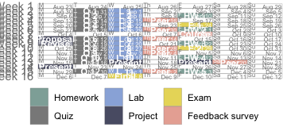

---
authors:
- admin
date: "2021-06-30T00:00:00Z"
draft: false
featured: false
image:
  caption: 'Image credit: [**Unsplash**](https://unsplash.com/photos/yEauzeZU6xo)'
  focal_point: ""
  placement: 2
  preview_only: true
lastmod: "2021-06-30T00:00:00Z"
projects: []
subtitle: 'Welcome to STA 198 / GLHLTH 298!'
summary: This is a tentative course schedule. The flow of topics might change slightly depending on how quickly / slowly it feels right to progress through them. However the deadlines for assignments will not change barring unexpected circumstances.
title: 'Overview'
---

The figure below is a visual summary of the tentative course schedule. The flow of topics for each week might change slightly depending on how quickly / slowly it feels right to progress through them. However, the deadlines for assignments will not change barring unexpected circumstances, which, unfortunately, may occur this semester! If deadlines need to be adjusted after the first day of class, they will be pushed to a later date and never pulled up to an earlier date. If it becomes necessary to make such adjustments, I will try my best to avoid collision with other previously scheduled deadlines, but this might be difficult to ensure.

