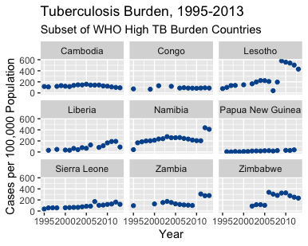

## Goals

- Effectively visualize numeric and categorical data
- Practice the data science workflow

## Configuring SSH and GitHub

In case you need to generate again the public key, here is a reminder of the steps from last week's lab.

- First, type `credentials::ssh_setup_github()` into your console.
- Second, R will ask "No SSH key found. Generate one now?" You should click 1 for yes.
- Third, you will generate a key. It will begin with "ssh-rsa...." R will then ask "Would you like to open a browser now?" You should click 1 for yes.
- Fourth, you may be asked to provide your username and password to log into GitHub. This would be the ones associated with your account that you set up. After entering this information, you should paste the key in and give it a name.

# Getting started

Go to the course GitHub organization and locate your lab02 repository, which
should have the prefix **lab-02**. Copy the URL of the repository and clone in RStudio. If you have trouble, see last week's lab for step-by-step instructions.

Then, configure git so that RStudio can communicate with GitHub.

Type the following lines of code in the **console** in RStudio filling in your name and the email address associated with your GitHub account.

```{r eval=FALSE}
library(usethis)
use_git_config(user.name = "GitHub username", user.email="your email")
```

Write your answers in the lab02.Rmd template file. Update the YAML header with your name and today's date. Then, knit the document and make sure the resulting 
PDF file has the correct date. Stage, commit, and push your changes.

# Packages

We will be using tidyverse to make plots in R!

```{r load-packages, message = FALSE, echo = FALSE}
library(tidyverse)
library(viridis)
library(scales)
```


# WHO Tuberculosis Data

The World Health Organization publishes an annual global tuberculosis (TB) report, which describes an assessment of the TB epidemic as well as progress in prevention, diagnosis, and treatment. We consider data from the WHO on TB from 1995-2013, included in R's `tidyverse` package. These data are not in a tidy format, so we start with some data wrangling (more next week; we will not show you that code for now), and we also combine these data with data on each country's population. We will work in lab with two resulting data sets.  One is the data set `whoage2`, which contains the variables `country`, `year`, `agecat` (age groups are 0-14, 15-24, 25-34, 35-44, 45-54, 55-64, and 65+), and `cases` (the case count). The other is the data set `whotbpop`, which contains the variables `country`, `year`, `cases`, `population`, and `cases100000` (cases per 100K population, calculated as cases divided by population times 100000).

```{r datawrangle, echo=FALSE, message=FALSE, warning=FALSE}
who2 <- who %>%
  pivot_longer(
    cols = new_sp_m014:newrel_f65, 
    names_to = "key", 
    values_to = "cases", 
    values_drop_na = TRUE
  ) %>% 
  mutate(
    key = stringr::str_replace(key, "newrel", "new_rel")
  ) %>%
  separate(key, c("new", "var", "sexage")) %>% 
  select(-new, -iso2, -iso3) %>% 
  separate(sexage, c("sex", "age"), sep = 1) 

who2$country=recode(who2$country, "United States of America" = "USA")


whoage <- who2 %>%
  group_by(country,year,var,age) %>%
  summarize(casecount=sum(cases)) %>%
  ungroup()

whoage$agecat=recode(whoage$age, `014` = "0-14", `1524` = "15-24", `2534` = "25-34", `3544` = "35-44", `4554` = "45-54", `5564` = "55-64", `65` = "65+" )

whoage2 <- whoage %>%
  group_by(country,year,agecat) %>%
  summarize(cases=sum(casecount)) %>%
  ungroup()

whocollapse <- whoage %>%
  group_by(country,year) %>%
  summarize(cases=sum(casecount)) %>%
  ungroup()

population$country=recode(population$country,"United States of America"="USA")

whotbpop <- right_join(whocollapse,population)
whotbpop$cases100000=whotbpop$cases/whotbpop$population*100000
```

All plots should follow the best visualization practices we have discussed in
lecture. Plots should include an informative title, axes should be labeled, and careful consideration should be given to aesthetic choices.

Your assignment should have at least three meaningful commits.

1. Make a histogram of the 2013 population of the countries. Set the bin width at 100,000,000. Label your axes and give the plot a title. Make sure the axis ticks on the x-axis are not in scientific notation using the scale option *scale_x_continuous(labels = label_comma()) *. Does it appear that there are any outliers? If so, what are they (Hint: use the data viewer!)?  Does the distribution appear to be symmetric or skewed?


```{r ex1, echo=FALSE}

```


2. Sometimes analysts use a *log transformation* in order to bring outliers in the right tail of a distribution closer to its center. Whether or not such a transformation is needed, make a histogram of the log (statisticians use log to indicate the natural log; in the rare cases we want the log base 10, we'll call it log$_{10}$) of the 2013 population of the countries (code to create the log population value is included). As before, label your axes and give the plot a title. Does it appear that there are any outliers in the new plot? If so, what are they?  Does the distribution appear to be symmetric or skewed? Briefly discuss when you might want to use the population histogram on the log scale versus when you might prefer using the original scale.


```{r ex2, message=FALSE}
whotbpop$logpop = log(whotbpop$population)

```


*Before going to Exercise 3, now would be a good time to do your first knit and then commit and push.*

3. Filter the data to include Pakistan, the USA, and four other countries of interest to you. Generate a scatterplot of `year` (x-axis) by TB cases per 100,000 population `cases100000` on the y-axis, with points colored by `country` and with size mapped to `population`. Please label your axes and legend and give the plot a title. 


Describe what you observe in the plot. Do you observe the same pattern for every country?

For the rest of this assignment, *country* will refer just to your 6 selected countries.

```{r ex3}


```


4. Now, examine the relationship between same two variables, with a separate facet for each of your six selected countries. You can drop the size aesthetic if you prefer. Be sure to label your axes. Which plot do you prefer? Briefly explain your choice.

```{r ex4, message=FALSE, warning=FALSE}


```


*Now would be a good time to knit, commit, and push, again.*

5. Do some years have more cases per 100,000 than others? Create faceted or side-by-side boxplots of `cases100000' for the years 2010, 2011, 2012, and 2013. Because of the global disparity in TB across countries, create a second plot using log(cases100000+1) instead of cases100000. (NOTE: we add 1 because some countries report 0 cases, and the log of 0 is undefined.) Code to create that new variable is included below. Briefly comment on what you notice. Is there much change in the distribution of the case rate per 100,000 over these four years?  

```{r ex5, warning=FALSE, message=FALSE}

whotbpop$logcase = log(whotbpop$cases100000 + 1)


```


6. Does each country selected have similar age composition of its TB cases? Create a segmented bar chart with one bar per `country`, each bar going from 0 - 1, with the fill determined by the age category to which the cases belong. What do you notice? (Hint: check out the summary count data.) *Our data are already in summary format (total population and total cases, not one line per person in each country), so we need to let R know that when we create a bar plot, there is no need to summarize the data first. We can either do that by replacing geom_bar() with geom_col(), or we can use the stat="identity" option in geom_bar to let R know not to count the data again, e.g. geom_bar(aes(values you want here),stat = "identity"), any other options you want). [Here's a nice reference explaining the difference in default behavior of geom_bar() and geom_col()](https://stackoverflow.com/questions/59008974/why-is-stat-identity-necessary-in-geom-bar-in-ggplot).*

```{r ex6, warning=FALSE, message=FALSE}

## summary case counts for two countries
casecounts <- whoage2 %>%
  filter(country %in% c("Uganda", "USA") &
           year == 2013) %>%
  group_by(country, agecat) %>%
  summarize(cases) 

# View(casecounts) 

```


*Now would be a good time to knit, commit, and push, again.*

7. Reproduce the plot below. HINT: the Hex color for Duke blue is #00539B.

[Learn more about ggplot2 color options!](http://sape.inf.usi.ch/quick-reference/ggplot2/colour)

```{r ex7, echo=FALSE, warning=FALSE, message=FALSE}



```

8. For extra credit (0-2 points), create your own innovative visualization of these data.

# Submission

Once you are fully satisfied with your lab, **Knit to PDF** to create a PDF document.

**Before you wrap up the assignment, make sure all documents are updated on your GitHub repo. we will be checking these to make sure you have been practicing how to commit and push changes.**

**Remember -- you must turn in a PDF file to the Gradescope page before the submission deadline for full credit.** 

Once your work is finalized in your GitHub repo, you will submit it to Gradescope. **Your assignment must be submitted on Gradescope by the deadline to be considered "on time".**

## Grading
Total: 50 pts

- Exercise 1: 6 pts
- Exercise 2: 6 pts
- Exercise 3: 6 pts
- Exercise 4: 6 pts
- Exercise 5: 6 pts
- Exercise 6: 6 pts
- Exercise 7: 6 pts
- Overall:  8 pts
- Bonus: up to 2 additional points (over 50)

  - Overall includes the number of commits made, naming chunks, updating the name on the assignment to your name, following tidyverse style (see: https://style.tidyverse.org/), and in general producing a nicely formatted, neat report. 