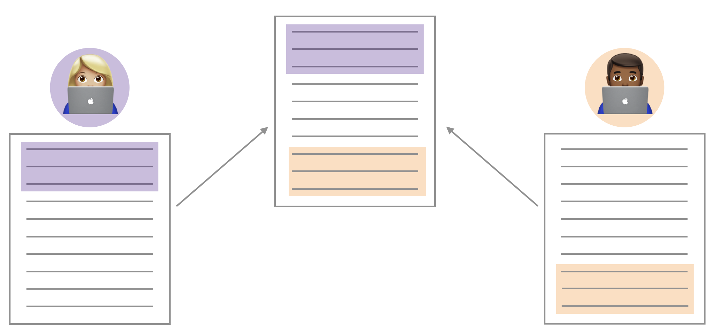

## Goals

- Appropriately handle merge conflicts

- Create informative spatial maps of data

## Getting Started

Log in to GitHub to determine your team number and members for Lab 4.

- Introduce yourself.
- Find a one hour block of time outside of class that you can use to work on the
lab / project if needed. You may not need to use this, but it is good to have it
in reserve. Tools like [Doodle](https://doodle.com/en/)
and [When2Meet](https://www.when2meet.com/) are helpful.
- Determine how your group will communicate (email, text, slack, discord, etc).

# Merge conflicts

```{r fig.margin=TRUE, eval=TRUE, echo=FALSE, results='show'}

```

You may have seen this already through the course of your collaboration last 
week in Lab 03. When two collaborators make changes to a file and push the file 
to their repository, git merges these two files.

```{r fig.margin=TRUE, eval = TRUE, echo=FALSE, results='show'}
knitr::include_graphics("04/merge-conflict.png")
```

If these two files have conflicting content on the same line, git will produce a
**merge conflict**. Merge conflicts need to be resolved manually, as they 
require a human intervention:

```{r fig.margin=FALSE, eval=TRUE, echo=FALSE, results='show'}
knitr::include_graphics("04/merge-conflict-identifiers.png")
```

To resolve the merge conflict, decide if you want to keep only your text/code, 
the text/code on GitHub, or incorporate changes from both sets. Delete the 
conflict markers `<<<<<<<`, `=======`, `>>>>>>>` and make the changes you want 
in the final merge.

**Assign numbers 1, 2, and 3 to each of your team members** (if only 2 team 
members, members 1-2 can share the work of 3). Go through the following steps in detail, 
which simulate a merge conflict. Completing this exercise will be part of the 
lab grade.

## Resolving a merge conflict

**Step 1**: *Everyone* clone your team lab and open the Rmd file.

*Member 3* should look at the group’s repo on GitHub to ensure that the other members’ files are pushed to GitHub after every step.

**Step 2**: *Member 1* should change the team name to your team name. 
            Knit, commit, and push.

**Step 3**: *Member 2* should change the team name to something different 
            (i.e., not your team name). Knit, commit, and push.

Member 2 should get an error on the attempted push.

Pull and review the document with the merge conflict. Member 2 should display 
and read the error to the entire team. A merge conflict occurred because 
Member 2 edited the same part of the document as Member 1. Resolve the conflict 
with whichever name you want to keep (please keep your real team name), 
then knit, commit with a message that clearly states you fixed the merge conflict, and push again.

**Step 4**: *Member 3* verifies the commit shows the merge conflict on GitHub. Then Member 3 writes some narrative below the last code chunk
            in your Rmd file. Knit, commit, and push.

This time, no merge conflicts should occur, since you edited a different part of
the document from Members 1 and 2. Member 3 should display 
and read the message to the entire team.

Everyone pull and delete the narrative. All team members should have the same
content in the Rmd file before proceeding to the exercises.


## Packages

```{r calltidy, message=FALSE, warning=FALSE}
library(tidyverse)
```

# Getting started

In case you forgot...

```{r eval=FALSE}
library(usethis)
use_git_config(user.name = "GitHub username", user.email="your email")
```

# Men's Health Gap: Life Expectancy

## Life Expectancy

- The [Institute for Health Metrics and Evaluation (IHME)](http://www.healthdata.org) is a resource for data on a variety of important health outcomes worldwide. 

- IHME maintains the [Global Burden of Disease (GBD)](http://ghdx.healthdata.org) tool, a valuable resource for policymakers and others that quantifies health loss due to a variety of risk factors, diseases, and injuries.

- We consider data from IHME on (estimated) infant life expectancy in 2019 as a function of location (primarily country) and binary gender. 

- Here **life expectancy** is the \# of years an infant can expect to live if mortality rates in the current year remain unchanged for the rest of their life. Life expectancy usually underestimates how long the baby will actually live, as mortality rates have been declining over time.


```{r message=FALSE}
life <- readr::read_csv("04/lifeexpectancy_infant.csv")

names(life)

```

## R packages

The R packages `ggplot2` and `sf` (for "simple features") have made it relatively straightforward to make great spatial maps. We'll use these packages along with `rnaturalearth` and `rnaturalearthdata` to access free spatial mapping tools for world maps. You'll need to install these yourself before proceeding.

```{r spatialpackages, message=FALSE, warning=FALSE}
# install.packages("rnaturalearth") 
# install.packages("rnaturalearthdata")
# install.packages("sf")
# install.packages("rgeos") # needed to pull countries for plot 
# ggplot2 is part of the tidyverse, so we don't have to call it
library(sf)
library(rnaturalearth)
library(rnaturalearthdata)
library(rgeos)
library(scales)
# the classic dark-on-light theme for ggplot2 is nice for maps
theme_set(theme_bw())
# world contains the country information for plotting in addition to a lot of other information about the countries
world <- ne_countries(scale = "medium", returnclass = "sf")
names(world)
```

Now let's get started!  

```{r firstworldplot}
ggplot(data=world) +
  geom_sf()
```

OK, that's the world (or one projection of it!). Let's dress up the map a bit. 

```{r worldmap}
ggplot(data = world) +
    geom_sf() +
    labs(x = "Longitude",
       y = "Latitude",
       title = "World Map")
```

The standard projection is a Mercator projection, with latitude and longitude at right angles. As you can see, this distorts the size of land masses at the poles. The ETRS89 Lambert Azimuthal Equal-Area projection is focused instead on Europe and Africa and does not force the map into a rectangular shape.

```{r eurocentric}
ggplot(data = world) +
  geom_sf() +
  coord_sf(crs = st_crs(3035)) +
  labs(title = "World Map")

```

We could also center our map on Asia.

```{r asiacentric}
ggplot(data = world) +
  geom_sf() +
  coord_sf(crs = st_crs(8859)) +
  labs(title = "World Map")

```


We can color the world Duke blue...

```{r worldmapblue}
ggplot(data = world) +
    geom_sf(color="black", fill="#00539B") +
    labs(x = "Longitude",
       y = "Latitude",
       title = "World Map")
```

but perhaps it's more informative to use color to convey information. In this plot, color is mapped to the square root of population (you can remove trans="sqrt" to see why the square root is used).

```{r worldmappop}
ggplot(data = world) +
  geom_sf(aes(fill = pop_est)) +
  scale_fill_viridis_c(option = "plasma", #color scheme
                       trans = "sqrt", #map color to sqrt(pop_est)
                       labels = label_comma()) + #avoid 1e9 notation
  labs(x = "Longitude",
       y = "Latitude",
       fill = "Population",
       title = "World Map")
```

Pretty nifty!  

We will be making plots of our life expectancy data. In order to do so, we need to do a bit of data wrangling.

1. First, restrict the life expectancy data to 2019 and then transform the data from long to wide format so that male and female life expectancies are on the same line (one line per country), to facilitate plotting 2019 data and combining with the mapping data. Create four new variables: a variable indicating whether the country's female life expectancy is > 80 years, a variable indicating whether the country's male life expectancy is > 80 years, a variable indicating whether the life expectancy in a country for males is greater than that for females, and a variable corresponding to the difference in years of life expectancy between females and males (calculate this by subtracting male life expectancy from female life expectancy); be sure to show your code chunk for this variable creation. Print a three-column table of country names and their  female and male life expectancies, just for those countries in which male life expectancy exceeds that of females and for those countries in which female life expectancy is 8 or more years greater than male life expectancy, and include a few sentences describing the findings in your table. Finally, provide the probability that a randomly-selected country's female life expectancy will be > 80, the probability that a randomly-selected country's male life expectancy will be > 80, and the probability a randomly-selected country's male life expectancy will be greater than that of its females. 


2. Let's get ready to plot!  The `world` data set is great because it provides [ISO country codes](https://unstats.un.org/unsd/tradekb/knowledgebase/country-code) that conform to international standards (ISO=International Organization for Standardization) to facilitate easy linkage across data sets. Sadly, the life expectancy data don't contain these handy codes. The code below creates a variable `long_name` in the `lifewide` dataset (I called my wide format data set `lifewide`, but feel free to use any name) to allow linkage with the `world` data set. Use it to join the two data sets, keeping only those countries present in the `world` data set (we can't plot if we don't have the location data incorporated anyway). Then, create three maps: one map showing female life expectancy worldwide, another showing male life expectancy worldwide, and a third showing the difference/disparity in life expectancy by gender (for this last map, use the ETRS89 Lambert Azimuthal Equal-Area projection). 


```{r fixnames, eval=FALSE}
library(sf)

lifewide$name_long=lifewide$location #create variable with same name as country variable in world in the lifewide data set for later merging of data sets

# fix inconsistent names, note use of ISO country codes would prevent having to do this!
lifewide <- lifewide %>%
  mutate(name_long = case_when(
    name_long == "Bolivia (Plurinational State of)" ~ "Bolivia",
    name_long == "Cabo Verde" ~ "Cape Verde",
    name_long == "Cote d'Ivoire" ~ "Côte d'Ivoire",
    name_long == "Congo" ~ "Republic of Congo",
    name_long == "Czechia" ~ "Czech Republic",
    name_long == "Democratic People's Republic of Korea" ~ "Dem. Rep. Korea",
    name_long == "Micronesia (Federated States of)" ~ "Federated States of Micronesia",
    name_long == "Gambia" ~ "The Gambia",
    name_long == "Iran (Islamic Republic of)" ~ "Iran",
    name_long == "Lao People's Democratic Republic" ~ "Lao PDR",
    name_long == "North Macedonia" ~ "Macedonia",
    name_long == "Republic of Moldova" ~ "Moldova",
    name_long == "Northern Mariana Islands" ~ "N. Mariana Is.",
    name_long == "Sao Tome and Principe" ~ "São Tomé and Principe",
    name_long == "Syrian Arab Republic" ~ "Syria",
    name_long == "Taiwan (Province of China)" ~ "Taiwan",
    name_long == "United Republic of Tanzania" ~ "Tanzania",
    name_long == "United States of America" ~ "United States",
    name_long == "Venezuela (Bolivarian Republic of)" ~ "Venezuela",
    name_long == "Viet Nam" ~ "Vietnam",
    TRUE ~ name_long
  ))

```


 


## Grading
Total: 50 pts

- Exercise 1: 20 pts
- Exercise 2: 20 pts
- Overall:  10 pts

  - Overall includes the number of commits made by different team members (at least 1 by each team member), creating and addressing the merge conflict, naming chunks, updating the names on the assignment to your team name clearly identifying all team members, following tidyverse style (see: https://style.tidyverse.org/), and in general producing a nicely formatted, neat report. 