```{r child = "../setup.Rmd"}
```


```{r global_options, include=FALSE}
knitr::opts_chunk$set(
  echo = TRUE,
  message = FALSE,
  warning = FALSE,
  comment = "#>",
  highlight = TRUE,
  fig.align = "center"
)
library(tidyverse)
library(tidymodels)
library(ggtext)
library(knitr)
library(kableExtra)
options(dplyr.print_min = 10, dplyr.print_max = 6)
```


class: middle

# Data: Artisanal and Small-Scale Gold Mining in the Peruvian Amazon

---

## Mercury and Community

[Artisinal and small-scale gold mining is largest source of mercury pollution worldwide](https://theconversation.com/gold-rush-mercury-legacy-small-scale-mining-for-gold-has-produced-long-lasting-toxic-pollution-from-1860s-california-to-modern-peru-133324).

Are mercury concentrations in hair related to community of residence?

```{r packages}
library(tidyverse)
library(tidymodels)
library(readr)
mercury <- readr::read_csv("mercury_reg.csv")
```


---

## Relationship between mercury and individual community

One way to explore this relationship is through a linear regression model, with *dummy* or *indicator variables* for community as predictors.

```{r hg-comm, eval=FALSE}
res <- linear_reg() %>%
  set_engine("lm") %>%
  fit(lhairHg ~ community, data = mercury) %>%
  tidy() 
print(res,n=23)
```

---


```{r ref.label="hg-comm", echo = FALSE}
```

---

- When the categorical explanatory variable has many levels, they're encoded to **indicator** or **dummy variables**

- Each coefficient describes the expected difference between hair mercury levels in that particular community compared to the baseline level

- Here, all the community mean hair mercury levels are different from those in Boca Colorado (the *referent* group, selected alphabetically) with the exception of Puquiri, Setapo, and Shintuya.

- What if we want to make comparisons between pairs of communities that don't involve Boca Colorado?  We'll address that shortly!

---

## ANOVA

When our predictor variable is categorical and the response is (approximately) normal (perhaps after transformation), often this type of model is fitted as an **ANOVA** model. **ANOVA or Analysis of Variance** refers to an approach when we have all categorical predictors, in which the hypothesis of interest is related to the degree of variability in the means across groups (versus within-group variability).  

We can think of ANOVA as a special case of regression, when all predictors are categorical. Technically, ANOVA is more of a tool to break apart different sources of variation in data.

---

First, let's explore hair Hg levels (in log ppm) by community in our data visually.


.panelset[
.panel[.panel-name[Plot]
```{r ref.label = "hg-comm-plot", echo = FALSE, warning = FALSE}
```
]
.panel[.panel-name[Code]

```{r hg-comm-plot, fig.show="hide"}
ggplot(data = mercury,
       aes(x = community, y = lhairHg,
           color = community)) +
  geom_boxplot() +
  labs(color = "NULL",
       y = "Hair Hg (log ppm)",
       x = "Community") +
  theme(
    axis.text.x = element_text(
      angle = 45,
      vjust = 1,
      hjust = 1,
      size = 6
    ),
    legend.position = "none"
  )
```
]
]

---

## Hypothesis of Interest

We might be interested in testing whether all the community means are the same or not.

$$H_0: \mu_{Boca Col}=\mu_{Boca Isi}=\cdots=\mu_{Shipitiari}$$

versus the alternative hypothesis that at least one of the community means is different.

One way to do this would be to use t-tests on all possible pairs of communities. In this case,  with 23 communities we would need to do $\begin{pmatrix} 23 \\ 2 \end{pmatrix}=253$ tests!  In addition to being time-consuming, carrying out multiple tests typically leads to an *inflated type I error rate*.

---

## Multiple Comparisons

- Suppose all means are truly equal, and we conduct all 253 pairwise tests

- Suppose also the tests are independent and done at a 0.05 significance level

- Then the probability we fail to reject all 253 tests (the right decision) is $(1-0.05)^{253}=0.95^{253} \approx 0$, and the probability of rejecting at least one of the 253 null hypotheses, called the **family-wise error rate**, is $\approx 1 >>0.05$

- In reality, this is a little more complicated (tests are not independent), but we still have the problem of an inflated type I error rate.

- ANOVA extends the t-test and is one way to control the overall type I error rate at a fixed level $\alpha$, if we only test pairwise differences when the *chunk* or *overall test* is rejected

---

## ANOVA Null Hypothesis

In ANOVA, we typically follow this testing procedure.  

- First, you conduct an *overall* or *chunk* test of the null hypothesis that the means of all of the groups are equal.

  - If you reject this null hypothesis, then we usually *step down* to see which means are different from each other.  A *multiple comparisons* correction is sometimes used for these pairwise comparisons of means.
  
  - If you do not reject the null hypothesis, this means our data are consistent with a population in which the means are all equal.  Generally, no further testing should be done.  

---

class: middle

# Multiple Comparisons in Action

---

## Overall Test

```{r echo=FALSE}
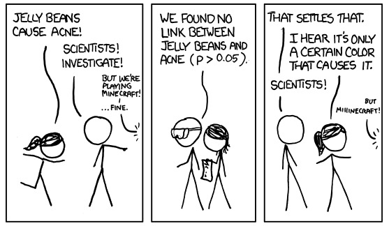
```

---

## Extra Test 1: Wild Blackberry

```{r echo=FALSE, out.width="25%"}
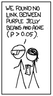
```

---

## Extra Test 2: Root Beer

```{r echo=FALSE, out.width="25%"}
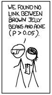
```

---

## Extra Test 3: Cotton Candy

```{r echo=FALSE, out.width="25%"}

```

---

## Extra Test 4: Island Punch

```{r echo=FALSE, out.width="25%"}
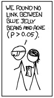
```

---

## Extra Test 5: Blueberry

```{r echo=FALSE, out.width="25%"}
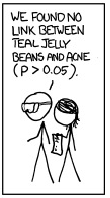
```

---

## Extra Test 6: Pink Grapefruit

```{r echo=FALSE, out.width="25%"}
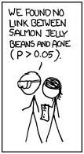
```

---

## Extra Test 7: Strawberry Jam

```{r echo=FALSE, out.width="25%"}
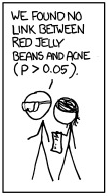
```

---

## Extra Test 8: Berry Blue

```{r echo=FALSE, out.width="25%"}
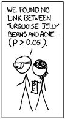
```

---


## Extra Test 9: Pomegranate

```{r echo=FALSE, out.width="25%"}
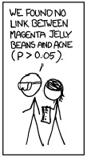
```

---

## Extra Test 10: Buttered Popcorn

```{r echo=FALSE, out.width="25%"}
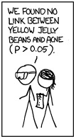
```

---

## Extra Test 11: Black Pepper 

```{r echo=FALSE, out.width="25%"}
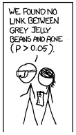
```

---

## Extra Test 12: Ear Wax 

```{r echo=FALSE, out.width="25%"}
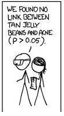
```

---

## Extra Test 13: Soap 

```{r echo=FALSE, out.width="25%"}
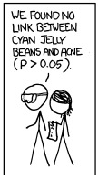
```

---

## Extra Test 14: Green Apple

```{r echo=FALSE, out.width="25%"}
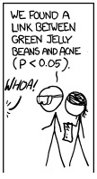
```

---


## Extra Test 15: Strawberry Cheesecake

```{r echo=FALSE, out.width="25%"}
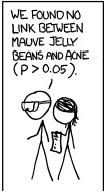
```

---

## GREEN APPLE!

```{r echo=FALSE, out.width="35%"}
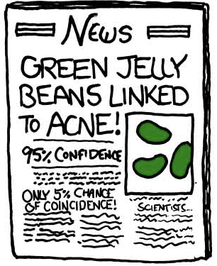
```

---

## Green Jelly Beans Again

Disclaimer:  So, uh, we did the green study again and got no link.  It was probably a -- "RESEARCH CONFLICTED ON GREEN JELLY BEAN-ACNE LINK; MORE STUDY RECOMMENDED!" headline.

Later, we'll learn how to control type I error rate for many comparisons.

---

class: middle

# Back to ANOVA

---

## Why Analyze Variance? 

ANOVA stands for *analysis of variance*.  


What does variance have to do with our null hypothesis, which is about equality of means, say $H_0: \mu_1=\mu_2=\cdots=\mu_K$ for K means? 


---

## General ANOVA Setup

- $H_0:  \mu_1=\mu_2=\cdots=\mu_K$

- $H_A:$  at least one of the means is different

  - NOT ONLY $H_A: \mu_1 \neq \mu_2 \neq \cdots \neq \mu_K$ (this would force all means to be different)
  
- Let the response of subject $j$ in group $i$ be given by $y_{ij}$, $i=1,2,\ldots,K$, $j=1,\ldots,n_i$

- $K$ is the number of groups

- $n_i$ is the number of subjects in group $i$

---

ANOVA model is $$y_{ij}=\mu_i+\varepsilon_{ij}$$ where we assume the $\varepsilon_{ij}$ are independent and normally distributed with mean 0 and variance $\sigma^2$.   
- $\varepsilon_{ij}$ represent random error about each group mean, $\mu_i$
- Model assumes the $y_{ij}$ are independent and normally distributed with mean $\mu_i$ and variance $\sigma^2$
- Sometimes you see the model broken out with $\mu_i=\mu+\alpha_i$, where $\mu$ represents the overall or *grand mean* and $\alpha_i$ represents each group's deviation from the overall mean
- Alternatively *reference cell* coding, like we used when fitting the regression model, could be used, where one group is the *referent group* and the other coefficients represent differences between each group and the referent group

---

## Assumptions of ANOVA

- Outcomes within groups are normally distributed

- *Homoscedastic variance* (same variance of individual observations in each group)

- Samples are independent

---

### Checking ANOVA Assumptions in Mercury Data: PPM Scale

.panelset[
.panel[.panel-name[Plot]
```{r ref.label = "facethistppm", echo = FALSE, warning = FALSE}
```

]
.panel[.panel-name[Code]

```{r facethistppm, fig.show="hide"}
mercury %>%
  ggplot(aes(x = exp(lhairHg))) +
    geom_histogram() +
    facet_wrap(~community) +
    labs(x = "Mercury (ppm)", y = NULL)

```
]
]


---


### Checking ANOVA Assumptions in Mercury Data: Log Scale

.panelset[
.panel[.panel-name[Plot]
```{r ref.label = "facethist", echo = FALSE, warning = FALSE}
```

]
.panel[.panel-name[Code]

```{r facethist, fig.show="hide"}
mercury %>%
  ggplot(aes(x = lhairHg)) +
    geom_histogram() +
    facet_wrap(~community) +
    labs(x = "Mercury (log ppm)", y = NULL)

```
]
]


---

## ANOVA Assumptions

- Normality: nothing looks terribly non-normal on the log scale, though some communities have relatively few measures

- Equal variances: more or less ok on the log scale

- Independence: this is an issue with these data, as some households provided multiple hair samples, and individuals within households may share exposure sources (e.g., meals), leading to correlated data within household. We will address this issue shortly.

---

## ANOVA for Mercury Data

- Let the hair mercury of subject $j$ in community $i$ be given by $y_{ij}$, $i=1,2,\ldots, 23$, $j=1,\ldots,n_i$
- We have 23 communities with $n_i$ subjects in each  
- For each community, calculate the sample mean and variance, so now we have $\bar{y}_1$ and ${s_1}^2$, $\bar{y}_2$ and ${s_2}^2$, and so on $\bar{y}_i$ and ${s_i}^2$ $i=1,\ldots,23$
- ANOVA is concerned with two different types of variances:  
  - *Within-groups variance*:  variance of the individual observations around their respective community means
  - *Between-groups variance*:  variance of the community means around the overall mean of all observations, $\bar{y}_\cdot$ 
  
---

## Overall variance

Variance of $y$ is estimated as $$s^2=\frac{\sum_{i=1}^K \sum_{j=1}^{n_i} (y_{ij}-\bar{y})^2}{n-1},$$ where $n=\sum_{i=1}^K n_i$ is the total sample size across all communities

---

## Within-groups variance

Each community's variance $${s}^2_i=\frac{\sum_{j=1}^{n_i} (y_{ij}-\overline{y}_i)^2}{n_i-1}$$ is a measure of the variance of the individuals around that community mean.  To get a pooled estimate of the common variance of individuals around their community means, we can calculate $${s_W}^2=\frac{(n_1-1){s_1}^2 + (n_2-1){s_2}^2 + \cdots + (n_K-1){s_K}^2}{n - K},$$ where $K$ is the number of groups and $n=n_1+n_2+\cdots+n_K$.  We can think of the within-groups variance as the inherent variability in the population.

---

### Between-groups variance

The between groups variance is estimated by $$s_B^2=\frac{n_1(\bar{y}_1-\bar{y}_\cdot)^2+n_2(\bar{y}_2-\bar{y}_\cdot)^2 + \cdots + n_K(\bar{y}_K-\bar{y}_\cdot)^2}{K-1}.$$


We can think of the between-groups variance as the sum of inherent variability *and* any kind of systematic variability due to the group/community effect.

---

## F test

Both ${s_W}^2$ and ${s_B}^2$ are estimates of the population variance $\sigma^2$ if $H_0$ is true.  Now, if the sample means vary around the overall mean (this variance measured by ${s_B}^2$) more than the individual observations vary around the sample means (measured by ${s_W}^2$), we have evidence that the corresponding group population means are in fact different (so that all $K$ means are not the same).

How do we compare the variances? Consider $$F=\frac{\text{inherent variability + group effect}}{\text{inherent variability}}.$$  If there is little to no group  effect (no group effect implies $H_0$ is true), this ratio will be very close to 1.

---

## F test

 Thus the F statistic is given by $$F={s_B}^2/{s_W}^2,$$ which if $H_0$ is true has an $F$ distribution with $K-1$ and $n-K$ df.  The df associated with ${s_B}^2$ are called the *numerator degrees of freedom* and correspond to the total number of groups minus 1.  The df associated with ${s_W}^2$ are called the *denominator degrees of freedom* and equal the total sample size minus the number of groups (we lose one df for each group mean we estimate).  For ANOVA the test is inherently one-tailed, rejecting $H_0$ only if $F$ is considerably larger than one.  (This does not mean we have a one-sided alternative; we just look at one tail of the F distribution to get the p-value, as the F statistic is never negative because variances cannot be negative.)
 
  
If there are only two groups, then the F test gives the same result as the t-test (with equal variances).
 
---

## F Distribution


```{r echo=FALSE,out.width="80%"}
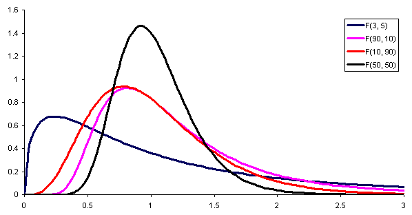
```
The numerator and denominator degrees of freedom (ndf and ddf) determine the cutpoint for a given $\alpha$ level.  The ndf is one less than the number of groups, and the ddf is the total number of observations minus the number of groups.

---

## Visualizing ANOVA

We can visualize the between and within groups variances, as well as how testing variances tells us about means, using [this cool R Shiny app](https://gallery.shinyapps.io/anova_shiny_rstudio/).


---

## ANOVA for Mercury Data

```{r anovahg}
summary(aov(lhairHg~community,data=mercury))
```

Here's the **overall test** of the null hypothesis that all 23 means are equal, versus the alternative that at least one mean is different.  Based on that p-value, these data, or more extreme data, would be highly unlikely if the null hypothesis were true. Next, we probably wish to know which means are different!

---

## Step-Down Tests

```{r holm}
# Holm's correction gives us good protection against type I errors under a wide variety of settings
hairpair <- pairwise.t.test(mercury$lhairHg,    mercury$community, p.adj = "holm")
sigpairs <- broom::tidy(hairpair) %>%
  filter(p.value<0.05) %>%
  arrange(group1,group2)
nrow(sigpairs)
```

OK, that's a lot of differences!  More community pairs are different than not.

---
```{r printsig}
print(sigpairs,n=10)
```

Most communities do differ in levels of hair mercury! 

---

## Write-up of Methods and Results

The data were analyzed using one-way ANOVA to test the overall hypothesis of no difference across communities, with planned step-down tests using a Holm correction for multiple comparisons when the overall hypothesis was rejected.

Using the overall F test (ndf=22, ddf=2285), a significant difference among the communities was identified (p<0.0001). Step-down tests indicated that mercury levels differed across the majority of pairwise community comparisons.

One challenge to the validity of this analysis is that multiple measures were obtained per household. If shared exposures or other factors induced positive correlations in mercury measures among household members, our standard errors would be too small, and our estimated significance levels would be anti-conservative.

---

class: middle

# Wait, is that wrong? Hold that thought.

---


## Bonferroni Correction

As we showed earlier, conducting multiple tests on a data set increases the *family-wise error rate*.  One very conservative way to ensure this is not the case is to divide $\alpha$ by the number of tests to be done and to use that as the significance level.  This procedure is called the Bonferroni correction. For example for two tests, to preserve an overall 0.05 type I error rate, the Bonferroni correction would use $\frac{\alpha}{2}=0.025$ as the significance level for each individual test instead of $0.05$.  Bonferroni is a conservative multiple comparisons correction (like saving your money in your mattress!), making it harder to reject the null hypothesis, but it is a safe bet in controlling the type I error rate. A less conservative method that also offers strong control of the error rate is Holm's method, which we used in our code.

---

## Violation of independence

The violation of the independence assumption due to the inclusion of multiple household members is indeed a concern.  To explore this, let's calculate the fraction of households (coded using `hid`) that provided hair measures from more than one household member.

.panelset[
.panel[.panel-name[Output]
```{r ref.label = "hg-hhid", echo = FALSE, warning = FALSE}
```
]
.panel[.panel-name[Code]

```{r hg-hhid, fig.show="hide"}
mercury %>%
  filter(is.na(lhairHg)==FALSE) %>%
  group_by(hid) %>%
  mutate(hhobs=n(),
         multmeas=(hhobs>1)) %>%
  group_by(community) %>%
  summarize(avgct=mean(multmeas))
```
]
]

---

## Concerns when Independence is Violated

Typically, observations within a household are positively correlated (e.g., if one family member has a high level of hair mercury, another family member is more likely to have high hair mercury). Ignoring this type of positive correlation within household can lead to estimated standard errors (and thus p-values) that are **too small** when we're estimating group means, invalidating our inferences.

---

## Simple Fix: Limit to One Person Per Household

The easiest solution to this problem is to limit the dataset to a single person per household. In this case, we'll limit to the household member denoted `withinid=1`.

```{r oneperhh}
mercuryone <- mercury %>%
  filter(withinid==1)

summary(aov(lhairHg~community,data=mercuryone))
```

Our dataset is much smaller now, but we still see differences across communities and reject the overall test.

---

```{r stepdownone}
hairpair <- pairwise.t.test(mercuryone$lhairHg,    mercuryone$community, p.adj = "holm")
sigpairs <- broom::tidy(hairpair) %>%
  filter(p.value<0.05) %>%
  arrange(group1,group2)
nrow(sigpairs)
```

---
```{r printsigone}
print(sigpairs,n=10)
```

Now just 55 community pair comparisons are different -- still a marked difference across communities.

---


## Random Effects ANOVA

Another way to address multiple measures in each household is to add a **random effect** for household, to allow data from individuals within households to be positively correlated. This allows us to use all the data but controls for the within-household correlation that causes us to violate the independence assumption, replacing it with a *conditional independence* assumption: conditional on household, individuals are independent.

The random effect allows the model to capture correlation between residents of the same household.

NOTE:  this discussion of *random effects ANOVA* is something you get for free with STA 198!  I'm not going to expect you to fit these models, but I will expect you just to know that if you have correlated data, a *random effects model* is a good option!

---

## Random effects results

```{r re}
library(lme4)
# need a factor version of hid
mercury <- mercury %>%
  mutate(hhid=as.factor(hid))

m1=lmer(lhairHg ~ community + (1 | hhid), data = mercury)
anova(m1)
```

As you can see, the F statistic is markedly smaller after accounting for within-household correlation. R does not provide a p-value here, as testing in this setting is quite tricky. The story at the end of the day is the same -- community matters.  If you want to learn more about these models (also called multi-level or hierarchical models), we have more classes for you to do just that!  

---

We can estimate the correlation, called the **inter class correlation** or **ICC**, as the ratio of the group variance to the total variance:
```{r icc}
library(performance)
icc(m1)
# you want the adjusted ICC
```

We interpret the ICC=0.49 as the correlation inside a household, or the fraction of variance explained by household membership.  The correlation here is quite large. We should not be making any decisions based on the first analysis that included multiple individuals per household with no adjustment for correlated data (the analysis limiting to one person per household is still fine).

---

```{r pairwise_re}
library(emmeans)
library(lmerTest)
library(pbkrtest)
paired <- m1 %>%
    emmeans(pairwise~community) 

paired$emmeans

```

Here we see estimated means by community.

---

To learn more about *random effects models*, also known as *hierarchical* or *multilevel* models, check out STA 210 (regression analysis) this spring.


