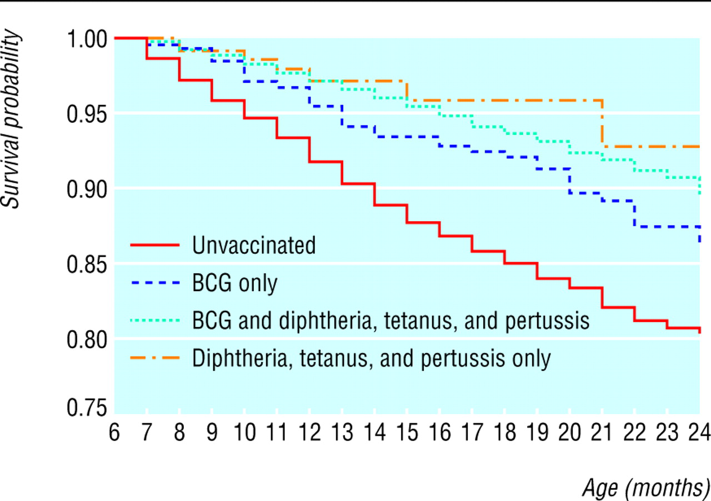
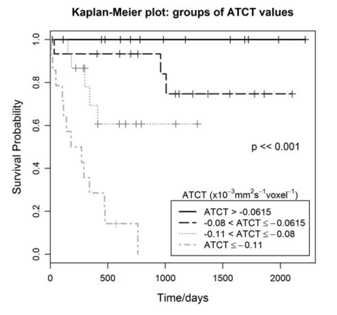

```{r child = "../setup.Rmd"}
```


```{r global_options, include=FALSE}
knitr::opts_chunk$set(
  echo = TRUE,
  message = FALSE,
  warning = FALSE,
  comment = "#>",
  highlight = TRUE,
  fig.align = "center"
)
```

```{r packages, echo = FALSE, message=FALSE, warning=FALSE}
library(tidyverse)
library(tidymodels)
library(gghighlight)
library(knitr)
set.seed(99999)
```

class: middle

# Health Data Science Ethics

---
## Health Data Science Ethics

Data science tools can be used ethically or unethically.

You might be asked to use your knowledge in a way that is
ethically questionable: because of business/policy goals, for the
pursuit of further knowledge, or because your boss tells you to do so. 

How do you train yourself to make the right decisions (or
reduce the likelihood of accidentally making the wrong
decisions) at those points?

---

class: middle

We consider a number of concerns and challenges in conducting ethical health data science work, including privacy, data provenance and sharing, consent, roles various governmental and non-governmental entities, fair distribution of benefits and burdens, and accountability. 

---

## Privacy

- One of the most difficult ethical challenges 
- When is consent required to use data, and how is consent obtained?
- Data that seem innocuous may in fact be quite revealing, especially when data from multiple sources are combined

---

## Privacy

[About My Info](https://aboutmyinfo.org/identity), based on work by Prof. Latanya Sweeney at Harvard, allows you to input very basic data (DOB, binary gender, and ZIP code) and tells you how "unique" you are with respect to others around you. If you'd like, give it a try! 

For example, I'm the only person with my date of birth and gender in my ZIP code, which contains a population of over 45,000 individuals.

--

## Privacy 

It is possible to obtain data from social media and use it to predict quite precisely a number of factors an individual may not yet have decided to "take public," and social media users often have expectations of privacy despite their online activity.

For example, Twitter data are in the public domain. How comfortable would you be with a suicide prevention program screening your tweets and alerting followers if you are considered to be at risk?  Such a program was launched in 2014 but shut down after only a week due to concerns about privacy and stigmatization.

---

## Data Sharing and Control

- Even in public health emergencies like the COVID-19 pandemic, data sharing across international borders is complex, and many political entities have varying degrees of bans on sharing across international borders.

- What is the role of public health surveillance vs data as a business asset?  

- What are reporting requirements for businesses or nonprofit organizations that may detect new outbreaks or health issues as part of their analytics efforts?


## Survival of Children in Burkina Faso by Vaccination Status 

```{r, echo=FALSE}

```

---

class: middle

# Estimating Survival Curves

---

## Small Study of 10 Patients
.pull-left[
| Patient | Event time $x$ | Event type |
|------:|-------:|---------:|
| 1 | 4.5 | Death |
| 2 | 7.5 | Death |
| 3 | 8.5 | Censored | 
| 4 | 11.5 | Death |
| 5 | 13.5 | Censored | 
| 6 | 15.5 | Death |
| 7 | 16.5 | Death |
| 8 | 17.5 | Censored | 
| 9 | 19.5 | Death |
| 10 | 21.5 | Censored |
]

.pull-right[
How do we estimate the survival curve for these data?
]

---

## Kaplan-Meier Estimate

Perhaps the most popular estimate of a survival curve is the *Kaplan-Meier* or *product-limit* estimate.  This method is actually fairly intuitive. Define the following quantities.
  - $I_t$:  \# at risk of failure at time $t$; those who did not fail before $t$ and those who were not censored before $t$; also known as the *risk set*
  - $d_t$:  \# who fail at time $t$
  - $q_t=\frac{d_t}{I_t}$:  estimated probability of failing at time $t$
  - $S(t)$:  cumulative probability of surviving beyond time $t$, estimated as 
$$\hat{S}(t)=\prod_{t_i \leq t} \left(1-\frac{d_{t_i}}{I_{t_i}}\right).$$
  - the $\prod$ symbol is for multiplication, e.g. $\prod_{i=1}^3 x_i=x_1x_2x_3$ and $\prod_{i=1}^5i=1 \times 2 \times 3 \times 4 \times 5$.

---

## Intutive how?

$$\hat{S}(t)=\prod_{t_i \leq t} \left(1-\frac{d_{t_i}}{I_{t_i}}\right)$$

At each time $t$, the probability of surviving is just $1-Pr(failing)$ (remember the complement rule, also know as the law of total probability!).  Before there are any failures in the data, our estimated $\hat{S}(t)=1$.  At the time of the first failure, this probability falls below 1 and is simply one minus the probability of failing at that time, or $1-\frac{\# ~ failures}{\#~at ~ risk~ of~ failing}$.

After the first failure, things get more complicated.  At the time of the second failure, you can calcuate $1-\frac{\# ~ failures}{\# ~ at ~risk ~  of ~ failing}$, but this doesn't provide the whole picture, as someone else has already died.  In fact, this is the *conditional probability* of surviving now that you've made it past the time of the first failure.  

---

## Welcome Back, Probability!

I promised you'd see probability laws again!  :)

Coming back to you next:  the multiplicative rule!

---

## Multiplicative Rule Saves the Day!

$$\hat{S}(t)=\prod_{t_i \leq t} \left(1-\frac{d_{t_i}}{I_{t_i}}\right)$$

How do you then calculate the total (unconditional) probability of survival?  That is just the product of the probability of surviving past the first failure times the conditional probability of surviving beyond the second failure given that you made it past the first, or 

.small[
$$Pr(\text{survive past first and second times}) $$
$$=Pr(\text{survive past first time})Pr(\text{survive past second time} \mid \text{survive past first time})$$
$$=\left(1-\frac{\# ~ failures ~at ~failure~ time~ 1}{\# ~at~ risk ~of ~failing ~at ~failure ~time ~1}\right)\left(1-\frac{\# ~of ~ failures ~ at ~ failure ~ time~  2}{\# ~ at ~ risk ~ of ~ failing ~ at ~ failure~  time~ 2}\right)$$
]

If someone is censored, they are no longer at risk of failing at the next failure time and are taken out of the *risk set* and out of the calculation.

---

### Kaplan-Meier (KM) Estimate

.small[
.pull-left[

| $t$ | # Failed: $d_t$ | # Censored | # Left: $I_{t+1}$ | $\hat{S}(t)$ |
|------:|-------:|---------:|------:|------:|
| 0.0 | 0 | 0 | | |
| 4.5 | 1 | 0 | | |
| 7.5 | 1 | 0 | | |
| 8.5 | 0 | 1 | | |
| 11.5 | 1 | 0 | | |
| 13.5 | 0 | 1 | | |
| 15.5 | 1 | 0 | | |
| 16.5 | 1 | 0 | | |
| 17.5 | 0 | 1 | | |
| 19.5 | 1 | 0 | | |
| 21.5 | 0 | 1 | | |
]
]

.pull-right[
$$\hat{S}(t)=\prod_{t_i \leq t} \left(1-\frac{d_{t_i}}{I_{t_i}}\right)$$
Remember $d_t$ is the # who fail at time $t$, and $I_t$ is the # at risk of failure at time $t$ (have not been censored and have not failed)

]

---

.small[
.pull-left[

| $t$ | # Failed: $d_t$ | # Censored | # Left: $I_{t+1}$ | $\hat{S}(t)$ |
|------:|-------:|---------:|------:|------:|
| 0.0 | 0 | 0 | <p style="color:red">10</p> | <p style="color:red">1</p> |
| 4.5 | 1 | 0 | | |
| 7.5 | 1 | 0 | | |
| 8.5 | 0 | 1 | | |
| 11.5 | 1 | 0 | | |
| 13.5 | 0 | 1 | | |
| 15.5 | 1 | 0 | | |
| 16.5 | 1 | 0 | | |
| 17.5 | 0 | 1 | | |
| 19.5 | 1 | 0 | | |
| 21.5 | 0 | 1 | | |
]
]

.small[

.pull-right[

$$\hat{S}(t)=\prod_{t_i \leq t} \left(1-\frac{d_{t_i}}{I_{t_i}}\right)$$

$\hat{S}(0)=1$

]
]

---

.small[
.pull-left[

| $t$ | # Failed: $d_t$ | # Censored | # Left: $I_{t+1}$ | $\hat{S}(t)$ |
|------:|-------:|---------:|------:|------:|
| 0.0 | 0 | 0 | 10 | 1 |
| 4.5 | 1 | 0 |  <p style="color:red">9</p> | <p style="color:red">$$1 \times \left(1-\frac{1}{10}=0.9\right)$$</p> |
| 7.5 | 1 | 0 | | |
| 8.5 | 0 | 1 | | |
| 11.5 | 1 | 0 | | |
| 13.5 | 0 | 1 | | |
| 15.5 | 1 | 0 | | |
| 16.5 | 1 | 0 | | |
| 17.5 | 0 | 1 | | |
| 19.5 | 1 | 0 | | |
| 21.5 | 0 | 1 | | |
]
]

.small[
.pull-right[

$$\hat{S}(t)=\prod_{t_i \leq t} \left(1-\frac{d_{t_i}}{I_{t_i}}\right)$$


$$Pr(\text{survive past time 4.5}) $$
$$=Pr(\text{survive past time 0}) $$
$$\times Pr(\text{survive past time 4.5} \mid \text{survive past time 0})$$
]

]

---


.small[
.pull-left[

| $t$ | # Failed: $d_t$ | # Censored | # Left: $I_{t+1}$ | $\hat{S}(t)$ |
|------:|-------:|---------:|------:|------:|
| 0.0 | 0 | 0 | 10 | 1 |
| 4.5 | 1 | 0 | 9 | 0.9 |
| 7.5 | 1 | 0 |  <p style="color:red">8</p> | <p style="color:red">$$0.9 \times \left(1-\frac{1}{9}\right)=0.8$$</p> |
| 8.5 | 0 | 1 | | |
| 11.5 | 1 | 0 | | |
| 13.5 | 0 | 1 | | |
| 15.5 | 1 | 0 | | |
| 16.5 | 1 | 0 | | |
| 17.5 | 0 | 1 | | |
| 19.5 | 1 | 0 | | |
| 21.5 | 0 | 1 | | |
]
]

.small[
.pull-right[


$$\hat{S}(t)=\prod_{t_i \leq t} \left(1-\frac{d_{t_i}}{I_{t_i}}\right)$$

$$Pr(\text{survive past time 7.5}) $$
$$=Pr(\text{survive past time 4.5})$$
$$\times Pr(\text{survive past time 7.5} \mid \text{survive past time 4.5})$$
]

]

---


.small[

.pull-left[

| $t$ | # Failed: $d_t$ | # Censored | # Left: $I_{t+1}$ | $\hat{S}(t)$ |
|------:|-------:|---------:|------:|------:|
| 0.0 | 0 | 0 | 10 | 1 |
| 4.5 | 1 | 0 | 9 | 0.9 |
| 7.5 | 1 | 0 |  8 | 0.8 |
| 8.5 | 0 | 1 | <p style="color:red">7</p> | <p style="color:red">$$0.8 \times \left(1-\frac{0}{8}\right)=0.8$$</p> |
| 11.5 | 1 | 0 | | |
| 13.5 | 0 | 1 | | |
| 15.5 | 1 | 0 | | |
| 16.5 | 1 | 0 | | |
| 17.5 | 0 | 1 | | |
| 19.5 | 1 | 0 | | |
| 21.5 | 0 | 1 | | |
]
]

.small[
.pull-right[

$$\hat{S}(t)=\prod_{t_i \leq t} \left(1-\frac{d_{t_i}}{I_{t_i}}\right)$$


$$Pr(\text{survive past time 8.5}) $$
$$=Pr(\text{survive past time 7.5})$$
$$\times Pr(\text{survive past time 8.5} \mid \text{survive past time 7.5})$$

]
]

---


.small[
.pull-left[

| $t$ | # Failed: $d_t$ | # Censored | # Left: $I_{t+1}$ | $\hat{S}(t)$ |
|------:|-------:|---------:|------:|------:|
| 0.0 | 0 | 0 | 10 | 1 |
| 4.5 | 1 | 0 | 9 | 0.9 |
| 7.5 | 1 | 0 |  8 | 0.8 |
| 8.5 | 0 | 1 | 7 | 0.8 |
| 11.5 | 1 | 0 | <p style="color:red">6</p> | <p style="color:red">$$0.8 \times \left(1-\frac{1}{7}\right)=0.69$$</p> |
| 13.5 | 0 | 1 | | |
| 15.5 | 1 | 0 | | |
| 16.5 | 1 | 0 | | |
| 17.5 | 0 | 1 | | |
| 19.5 | 1 | 0 | | |
| 21.5 | 0 | 1 | | |
]
]

.small[
.pull-right[
$$\hat{S}(t)=\prod_{t_i \leq t} \left(1-\frac{d_{t_i}}{I_{t_i}}\right)$$


$$Pr(\text{survive past time 11.5}) $$
$$=Pr(\text{survive past time 8.5})$$
$$\times Pr(\text{survive past time 11.5} \mid \text{survive past time 8.5})$$

]
]

---


.small[
.pull-left[

| $t$ | # Failed: $d_t$ | # Censored | # Left: $I_{t+1}$ | $\hat{S}(t)$ |
|------:|-------:|---------:|------:|------:|
| 0.0 | 0 | 0 | 10 | 1 |
| 4.5 | 1 | 0 | 9 | 0.9 |
| 7.5 | 1 | 0 |  8 | 0.8 |
| 8.5 | 0 | 1 | 7 | 0.8 |
| 11.5 | 1 | 0 | 6 | 0.69 |
| 13.5 | 0 | 1 | <p style="color:red">6</p> | <p style="color:red">$$0.69 \times \left(1-\frac{0}{6}\right)=0.69$$</p> |
| 15.5 | 1 | 0 | | |
| 16.5 | 1 | 0 | | |
| 17.5 | 0 | 1 | | |
| 19.5 | 1 | 0 | | |
| 21.5 | 0 | 1 | | |
]
]

.small[
.pull-right[


$$\hat{S}(t)=\prod_{t_i \leq t} \left(1-\frac{d_{t_i}}{I_{t_i}}\right)$$

$$Pr(\text{survive past time 13.5}) $$
$$=Pr(\text{survive past time 11.5})$$
$$\times Pr(\text{survive past time 13.5} \mid \text{survive past time 11.5})$$

]
]

---

.small[
.pull-left[

| $t$ | # Failed: $d_t$ | # Censored | # Left: $I_{t+1}$ | $\hat{S}(t)$ |
|------:|-------:|---------:|------:|------:|
| 0.0 | 0 | 0 | 10 | 1 |
| 4.5 | 1 | 0 | 9 | 0.9 |
| 7.5 | 1 | 0 |  8 | 0.8 |
| 8.5 | 0 | 1 | 7 | 0.8 |
| 11.5 | 1 | 0 | 6 | 0.69 |
| 13.5 | 0 | 1 | 5 | 0.69 |
| 15.5 | 1 | 0 | <p style="color:red">4</p> | <p style="color:red">$$0.69 \times \left(1-\frac{1}{5}\right)=0.552$$</p> |
| 16.5 | 1 | 0 | | |
| 17.5 | 0 | 1 | | |
| 19.5 | 1 | 0 | | |
| 21.5 | 0 | 1 | | |
]
]

.small[
.pull-right[


$$\hat{S}(t)=\prod_{t_i \leq t} \left(1-\frac{d_{t_i}}{I_{t_i}}\right)$$

$$Pr(\text{survive past time 15.5}) $$
$$=Pr(\text{survive past time 13.5})$$
$$\times Pr(\text{survive past time 15.5} \mid \text{survive past time 13.5})$$

]
]

---

.small[
.pull-left[

| $t$ | # Failed: $d_t$ | # Censored | # Left: $I_{t+1}$ | $\hat{S}(t)$ |
|------:|-------:|---------:|------:|------:|
| 0.0 | 0 | 0 | 10 | 1 |
| 4.5 | 1 | 0 | 9 | 0.9 |
| 7.5 | 1 | 0 |  8 | 0.8 |
| 8.5 | 0 | 1 | 7 | 0.8 |
| 11.5 | 1 | 0 | 6 | 0.69 |
| 13.5 | 0 | 1 | 5 | 0.69 |
| 15.5 | 1 | 0 | 4 | 0.552 |
| 16.5 | 1 | 0 | <p style="color:red">3</p> | <p style="color:red">$$0.552 \times \left(1-\frac{1}{4}\right)=0.414$$</p> |
| 17.5 | 0 | 1 | | |
| 19.5 | 1 | 0 | | |
| 21.5 | 0 | 1 | | |
]
]

.small[
.pull-right[


$$\hat{S}(t)=\prod_{t_i \leq t} \left(1-\frac{d_{t_i}}{I_{t_i}}\right)$$


$$Pr(\text{survive past time 16.5}) $$
$$=Pr(\text{survive past time 15.5})$$
$$\times Pr(\text{survive past time 16.5} \mid \text{survive past time 15.5})$$

]
]

---

.small[
.pull-left[

| $t$ | # Failed: $d_t$ | # Censored | # Left: $I_{t+1}$ | $\hat{S}(t)$ |
|------:|-------:|---------:|------:|------:|
| 0.0 | 0 | 0 | 10 | 1 |
| 4.5 | 1 | 0 | 9 | 0.9 |
| 7.5 | 1 | 0 |  8 | 0.8 |
| 8.5 | 0 | 1 | 7 | 0.8 |
| 11.5 | 1 | 0 | 6 | 0.69 |
| 13.5 | 0 | 1 | 5 | 0.69 |
| 15.5 | 1 | 0 | 4 | 0.552 |
| 16.5 | 1 | 0 | 3 | 0.414 |
| 17.5 | 0 | 1 | <p style="color:red">2</p> | <p style="color:red">$$0.414 \times \left(1-\frac{0}{3}\right)=0.414$$</p> |
| 19.5 | 1 | 0 | | |
| 21.5 | 0 | 1 | | |
]
]

.small[
.pull-right[


$$\hat{S}(t)=\prod_{t_i \leq t} \left(1-\frac{d_{t_i}}{I_{t_i}}\right)$$


$$Pr(\text{survive past time 17.5}) $$
$$=Pr(\text{survive past time 16.5})$$
$$\times Pr(\text{survive past time 17.5} \mid \text{survive past time 16.5})$$

]
]

---


.small[
.pull-left[

| $t$ | # Failed: $d_t$ | # Censored | # Left: $I_{t+1}$ | $\hat{S}(t)$ |
|------:|-------:|---------:|------:|------:|
| 0.0 | 0 | 0 | 10 | 1 |
| 4.5 | 1 | 0 | 9 | 0.9 |
| 7.5 | 1 | 0 |  8 | 0.8 |
| 8.5 | 0 | 1 | 7 | 0.8 |
| 11.5 | 1 | 0 | 6 | 0.69 |
| 13.5 | 0 | 1 | 5 | 0.69 |
| 15.5 | 1 | 0 | 4 | 0.552 |
| 16.5 | 1 | 0 | 3 | 0.414 |
| 17.5 | 0 | 1 | 2 | 0.414 |
| 19.5 | 1 | 0 | <p style="color:red">1</p> | <p style="color:red">$$0.414 \times \left(1-\frac{1}{2}\right)=0.207$$</p> |
| 21.5 | 0 | 1 | | |
]
]

.small[
.pull-right[


$$\hat{S}(t)=\prod_{t_i \leq t} \left(1-\frac{d_{t_i}}{I_{t_i}}\right)$$

$$Pr(\text{survive past time 19.5}) $$
$$=Pr(\text{survive past time 17.5})$$
$$\times Pr(\text{survive past time 19.5} \mid \text{survive past time 17.5})$$

]
]

---

.small[
.pull-left[

| $t$ | # Failed: $d_t$ | # Censored | # Left: $I_{t+1}$ | $\hat{S}(t)$ |
|------:|-------:|---------:|------:|------:|
| 0.0 | 0 | 0 | 10 | 1 |
| 4.5 | 1 | 0 | 9 | 0.9 |
| 7.5 | 1 | 0 |  8 | 0.8 |
| 8.5 | 0 | 1 | 7 | 0.8 |
| 11.5 | 1 | 0 | 6 | 0.69 |
| 13.5 | 0 | 1 | 5 | 0.69 |
| 15.5 | 1 | 0 | 4 | 0.552 |
| 16.5 | 1 | 0 | 3 | 0.414 |
| 17.5 | 0 | 1 | 2 | 0.414 |
| 19.5 | 1 | 0 | 1 | 0.207 |
| 21.5 | 0 | 1 | <p style="color:red">1</p> | <p style="color:red">$$0.207 \times \left(1-\frac{0}{1}\right)=0.207$$</p> |
]
]

.small[
.pull-right[


$$\hat{S}(t)=\prod_{t_i \leq t} \left(1-\frac{d_{t_i}}{I_{t_i}}\right)$$


$$Pr(\text{survive past time 21.5}) $$
$$=Pr(\text{survive past time 19.5})$$
$$\times Pr(\text{survive past time 21.5} \mid \text{survive past time 19.5})$$

]
]

---

## KM Estimate

In between failure times, the KM estimate does not change but is constant.  This gives the estimated survival function its step-like appearance (we call this type of function a *step function*).

---

## Tumors in Children, 2012 *Neuro-Oncology*


.pull-left[
ATCT is an imaging-based biomarker of tumor prognosis.

```{r, echo=FALSE, out.width="90%"}


```
]
.pull-right[
- Which biomarker values are associated with the best survival?
- Which values are associated with the worst survival?
- What is the median survival time in the group with the smallest ATCT values?
  - Median survival is the time at which $\hat{S}(t)=0.5$
- If a child is in the group with the largest ATCT values, what is their estimated 5-year survival probability?
]

---

## Lung Cancer Data

The `lung` dataset is available from the `survival` package in R. The data contain subjects with advanced lung cancer. Variables include the following.

`time`: Survival time in days

`status`: censoring status 1=censored, 2=dead (failure) (note:  another common coding recognized by R is to let 0=censored and 1=failure)

`ph.ecog`: Eastern Cooperative Oncology Group (ECOG) performance score, where 0=asymptomatic, 1=symptomatic but ambulatory, 2=in bed <50% of day, 3=in bed >50% of day but not bedbound, 4=bedbound

---

## KM Plot for Lung Cancer Data

.panelset[
.panel[.panel-name[Plot]
```{r ref.label = "surv-plot", echo = FALSE, warning = FALSE}
```
]
.panel[.panel-name[Code]

```{r surv-plot, fig.show="hide"}
library(survival)
library(survminer)

ggsurvplot(
  fit = survfit(Surv(time, status)~ph.ecog, data=lung),
  title = "Survival by Performance Score",
  xlab = "Days",
  ylab = "Survival probability"
)
```
]
]
---

## Estimating Median Survival

One quantity of interest is the median survival time.

```{r medsurv}
survfit(Surv(time, status) ~ ph.ecog, data = lung)
```

Note: because there was only 1 bedridden patient, the median survival time is the survival time of that patient, and there is no confidence interval provided.

---

## Comparing Survival Across Groups

The **log-rank test** is a standard test for comparing groups when we have survival data. Here we use it to test the null hypothesis that there is no difference in survival between the groups, versus the alternative that there is a difference in survival.

```{r logrank}
survdiff(Surv(time,status)~ph.ecog, data=lung)
```

Here we see $p<0.0001$ and reject the null hypothesis, concluding that there is evidence in the data of a difference in survival across the groups.

---

## Cox Proportional Hazards Model

Suppose we have multiple covariates of interest. For example, in the lung cancer data, we also have covariates like `wt.loss` (weight loss in the past 6 months) and `age`.  If we want to fit a model to survival data, the **Cox proportional hazards model** is a popular choice.

The Cox proportional hazards model has a couple of important assumptions that are beyond the scope of this course (non-informative censoring, meaning censoring times are unrelated to the unobserved failure time, and the proportional hazards assumption, meaning that the hazards of failure are proportional across groups). You should explore these more if you plan to model survival data.

---

## Cox Model for Lung Cancer Data

.pull-left[
```{r cox}
library(gtsummary)

coxph(Surv(time, status) ~ 
        as.factor(ph.ecog)+
        wt.loss+age, 
      data = lung) %>%
    tbl_regression(exp = TRUE) 
```
]
.pull-right[
The estimates labeled `exp(coef)` are interpreted as *hazard ratios*. That is, patients who spend >50% of their time in bed but who are not bedridden (group 2) have 2.5 times the hazard of failure as patients with no symptoms, conditional on age and weight loss.
]

---

## Hazard Ratio (HR)

- The HR represents the ratio of hazards between two groups at any particular point in time.

- The HR compares instantaneous rates of occurrence of the event of interest in those who are still at risk for the event. 

- HR < 1 indicates reduced hazard of death;  HR > 1 indicates an increased hazard of death

So our HR = 2.5 implies that around 2.5 times as many people who are bedridden are dying as those who are asymptomatic, at any given time, conditional on age and weight loss.


