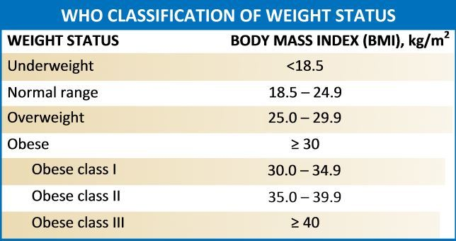

```{r child = "../setup.Rmd"}
```

```{r packages, echo=FALSE, message=FALSE, warning=FALSE}
library(tidyverse)

```


# Main Ideas

- Organizing our data according to a consistent set of "tidy" principles makes
data easy to work with and leverages the ways `R` is effective.

- Often we need to wrangle our data in order to extract meaning (including
creating new variables, calculating summary statistics, subsetting data, etc).

- Using only **seven key verbs** we can accomplish a wide variety of data 
wrangling tasks.

---

## Tidy Principles

Tidy data have three related characteristics

1. Each variable forms a column.

2. Each observation forms a row.

3. Each value has its own cell.

---

## Rural and Urban Patterns of Global Obesity

Obesity is a major risk factor for numerous non-communicable diseases, including diabetes, cardiovascular disease, hypertension, stroke, and some cancers. We consider data from an exercise developed by the [Johns Hopkins Open Case Studies Project](https://www.opencasestudies.org/ocs-bp-rural-and-urban-obesity/#Motivation) on average body mass index around the world.

Body mass index (BMI) is calculated as weight in kg divided by the square of height in m:  $BMI=\frac{kg}{m^2}$. While it is not a perfect surrogate for adiposity (e.g., people may have a high BMI due to muscle mass rather than body fat), it is an easily-obtained surrogate that is related to health outcomes of interest.

---

## WHO Classification of BMI

```{r echo=FALSE, out.width="100%"}

```

---

## Data

Our data include summaries of BMI from 200 countries worldwide, both at the national level and in urban and rural areas separately, for the years 1985 and 2017, separately for men and women.

---


## Data Wrangling

Often we need to wrangle our data to extract meaning. This includes calculating
new variables, summary statistics, grouping by variables, renaming, reordering, 
selecting subsets of data, filtering by various conditions, etc.

We can accomplish a great deal of wrangling by learning just 
**seven key verbs**. Each of these functions takes a data frame as input and 
returns a data frame as output.

- filter
- arrange
- select
- slice
- mutate
- summarize
- group_by


---

We first explore the data a bit. 

```{r explore-data}
load("BMI_long.Rdata")
glimpse(BMI_long)
names(BMI_long)

```

---


```{r explore-data2}
head(BMI_long)
```

The `head()` function returns "A tibble: 6 x 5" and then the first six rows of
the `BMI_long` data. A **tibble** is a tweaked, opinionated version of the `R`
data frame. 

---

There are a few differences a `tidyverse` tibble and an `R` data frame. We discuss two primary differences.

First, a tibble provides more information than a data frame. When you print a tibble, 
it will show the first ten rows and all of the columns that fit on the screen,
along with the type of each column. Try this with the `BMI_long` data.

You can 
modify the number of rows and columns shown using the `print()` function options.

Second, tibbles are somewhat more strict than data frames when it comes to 
subsetting data.

---

### `select()`

The `select()` function picks off one or more columns by name.

Let's say we want a dataset that only contains the variable BMI.

```{r select-vars}
select(BMI_long, BMI)
```

---

We can also use `select()` to exclude variables. Let's exclude `BMI` but
keep all other variables.

```{r exclude-vars}
select(BMI_long, -BMI)
```

---

We can also use `select()` to select a range of variables. Here, we select the 
first three variables.

```{r include-range}
select(BMI_long, Country:Region)
```

---

### `arrange()`

The `arrange()` function orders rows (observations) in specific ways. 

Let's arrange the data by descending BMI, with large BMI values on top.

```{r arrange-BMI-desc}
arrange(BMI_long, desc(BMI))
```

---

Or with low BMI values on top.

```{r arrange-BMI-asc}
arrange(BMI_long, BMI)
```

---

### The Pipe

The pipe is a technique for passing information from one process to another. 

```{r pipe-demo}
BMI_long %>%
  arrange(desc(BMI)) %>%
  select(Country, BMI)
```

When reading code "in English", say "and then" whenever you see a pipe.

---

### `slice()`

Slice selects rows based on their position.

Here we slice off the first 5 rows of the `BMI_long` data.

```{r slice}
BMI_long %>%
  slice(1:5)
```

---

**Question:** What is the code chunk below accomplishing? Guess before running
the code.


.panelset[
.panel[.panel-name[Code]
```{r arrange-slice-code, eval = FALSE, warning = FALSE}
BMI_long %>%
  arrange(desc(BMI)) %>%
  slice(1:5)
```
]
.panel[.panel-name[Output]
```{r arrange-slice, echo=FALSE, warning = FALSE}
BMI_long %>%
  arrange(desc(BMI)) %>%
  slice(1:5)
```
]
]

---


To add comments to code, use the pound sign. This is helpful for debugging as 
well - you can temporarily disable a line.

**Question:** What will happen if you comment out the line containing 
`arrange()` in the previous code chunk? Try it.


.panelset[
.panel[.panel-name[Code]
```{r comment, eval = FALSE, warning = FALSE}
BMI_long %>%
  #arrange(desc(BMI)) %>%
  slice(1:5)
```
]
.panel[.panel-name[Output]
```{r comment2, echo=FALSE, warning = FALSE}
BMI_long %>%
  #arrange(desc(BMI)) %>%
  slice(1:5)
```
]
]


---

### `filter()`

`filter()` selects rows satisfying certain conditions.

We can use a single condition. Here we select all rows where the country is Iceland.

```{r Iceland}
BMI_long %>%
  filter(Country == "Iceland")
```

---

We can use more than one condition. Here we select all rows where the 
Country is Iceland and the year is 2017.

```{r Iceland2017}
BMI_long %>%
  filter(Country == "Iceland", Year == 2017)
```


---

More complex conditions are possible!

**Question:** In plain English, what is the code below accomplishing?

```{r question}
BMI_long %>%
  filter(Country %in% c("Iceland", "Ireland"),
         Year == 2017 | Region == "National")
```

---

The table of logical operators below will be helpful as you work with filtering.

|operator | definition |
|:----------|:--------|
| `<` |   is less than? |
| `<=` |   is less than or equal to? |
| `>` |   is greater than? |
| `>=` |   is greater than or equal to? |
| `==` |   is exactly equal to? |
| `!=` |   is not equal to? |
| `x & y` |   is x AND y? |
| x $\mid$ y |   is x OR y? |


---


The table of logical operators below will be helpful as you work with filtering.

|operator | definition |
|:----------|:--------|
| `is.na(x)` |   is x NA? |
| `!is.na(x)` |   is x not NA? |
| `x %in% y` |   is x in y? |
| `!(x %in% y)` |   is x not in y? |
| `!x` |   is not x? |


The final operator only makes sense if `x` is logical (TRUE / FALSE).

R denotes missing values by NA. Missing values can cause biased or misleading results in any analysis, and it is important to understand why values are missing before drawing conclusions from data, especially if the fraction of missing values is not very small.

---


### `mutate()`

`mutate()` creates a new variable. Here we categorize BMI using the WHO classification.

.panelset[
.panel[.panel-name[Code]
```{r calc-categories, eval = FALSE, warning = FALSE}
BMI_long %>%
  mutate(bmiclass = cut(BMI,
    breaks = c(-Inf, 18.5, 25, 30, 35, 40, Inf),
    labels = c(
      "Underweight",
      "Normal Range",
      "Overweight",
      "Obese I",
      "Obese II",
      "Obese III"
    ),
    right = FALSE #intervals [a,b)
  )) %>%
  select(BMI, bmiclass)
```
]
.panel[.panel-name[Output]
```{r calc-categories2, echo=FALSE, warning = FALSE}
BMI_long %>%
  mutate(bmiclass = cut(
    BMI,
    breaks = c(-Inf, 18.5, 25, 30, 35, 40, Inf),
    labels = c(
      "Underweight",
      "Normal Range",
      "Overweight",
      "Obese I",
      "Obese II",
      "Obese III"
    ),
    right = TRUE
  )) %>%
  select(BMI, bmiclass)
```
]
]


---

Using `==` in the mutate creates a new variable `normal_range` that is TRUE if the BMI is in the normal range and FALSE if it is not.

.panelset[
.panel[.panel-name[Code]
```{r isnormal, eval = FALSE, warning = FALSE}
BMI_long %>%
  mutate(bmiclass = cut(
    BMI,
    breaks = c(-Inf, 18.5, 25, 30, 35, 40, Inf),
    labels = c(
      "Underweight",
      "Normal Range",
      "Overweight",
      "Obese I",
      "Obese II",
      "Obese III"
    ),
    right = TRUE
  )) %>%
  mutate(normal_range = bmiclass == "Normal Range") %>%
  print()
```
]
.panel[.panel-name[Output]
```{r isnormal2, echo=FALSE, warning = FALSE}
BMI_long %>%
  mutate(bmiclass = cut(
    BMI,
    breaks = c(-Inf, 18.5, 25, 30, 35, 40, Inf),
    labels = c(
      "Underweight",
      "Normal Range",
      "Overweight",
      "Obese I",
      "Obese II",
      "Obese III"
    ),
    right = TRUE
  )) %>%
  mutate(normal_range = bmiclass == "Normal Range") %>%
  print()
```
]
]

---

### `summarize()`

`summarize` calculates summary statistics. It collapses rows into summary 
statistics and removes columns irrelevant to the calculation. Be sure to name your columns!

.panelset[
.panel[.panel-name[Code]
```{r find-propnormal, eval = FALSE, warning = FALSE}
BMI_long %>%
  mutate(bmiclass = cut(BMI,
    breaks = c(-Inf, 18.5, 25, 30, 35, 40, Inf),
    labels = c(
      "Underweight",
      "Normal Range",
      "Overweight",
      "Obese I",
      "Obese II",
      "Obese III"
    ),
    right = TRUE
  )) %>%
  mutate(normal_range = bmiclass == "Normal Range") %>%
  summarize(fracnormal = mean(normal_range))
```
]
.panel[.panel-name[Output]
```{r find-propnormal2, echo=FALSE, warning = FALSE}
BMI_long %>%
  mutate(bmiclass = cut(BMI,
    breaks = c(-Inf, 18.5, 25, 30, 35, 40, Inf),
    labels = c(
      "Underweight",
      "Normal Range",
      "Overweight",
      "Obese I",
      "Obese II",
      "Obese III"
    ),
    right = TRUE
  )) %>%
  mutate(normal_range = bmiclass == "Normal Range") %>%
  summarize(fracnormal = mean(normal_range))
```
]
]

---

**Question:** The code chunk returns an NA. What is going wrong? 


.panelset[
.panel[.panel-name[Code]
```{r chckna, eval = FALSE, warning = FALSE}
BMI_long %>%
  mutate(bmiclass = cut(BMI,
    breaks = c(-Inf, 18.5, 25, 30, 35, 40, Inf),
    labels = c(
      "Underweight",
      "Normal Range",
      "Overweight",
      "Obese I",
      "Obese II",
      "Obese III"
    ),
    right = TRUE
  )) %>%
  count(bmiclass) %>%
  group_by(bmiclass) 
```
]
.panel[.panel-name[Output]
```{r checkna2, echo=FALSE, warning = FALSE}
BMI_long %>%
  mutate(bmiclass = cut(BMI,
    breaks = c(-Inf, 18.5, 25, 30, 35, 40, Inf),
    labels = c(
      "Underweight",
      "Normal Range",
      "Overweight",
      "Obese I",
      "Obese II",
      "Obese III"
    ),
    right = TRUE
  )) %>%
  count(bmiclass) %>%
  group_by(bmiclass) 
```
Ahh, count() is a very useful function!
]
]

---
Ahh, there were 18 missing values of the variable `bmiclass`!  First, let's check to be sure we didn't code that new variable incorrectly by seeing if the source variable, BMI, also has some missing values.


.panelset[
.panel[.panel-name[Code]
```{r checkbmina, eval = FALSE, warning = FALSE}
BMI_long %>%
  count(BMI=="NA")
```
]
.panel[.panel-name[Output]
```{r checkbmina2, echo=FALSE, warning = FALSE}
BMI_long %>%
  count(BMI=="NA")
```

OK great, so the problem was with the source variable. We can just drop those few NA's when we take the mean, so that we get the mean of the observed values. In general, one would follow up on the NA values to understand why data were missing. What seems to be the issue here?
]
]


---

Let's print all 18 variables and see if we can tell what's going on.

```{r nainvestigate, eval=FALSE}
BMI_long %>%
  filter(is.na(BMI)==TRUE) %>%
  print(n=18)
```

---

```{r nainvestigate2, echo=FALSE}
BMI_long %>%
  filter(is.na(BMI)==TRUE) %>%
  print(n=18)
```

This makes sense! Hong Kong, Singapore, Bermuda, and Nauru do not classify any of their population as rural; Tokelau does not classify any of its population as urban. 

---

Finally, let's get the proportion of values with mean BMI in the normal range.

.panelset[
.panel[.panel-name[Code]
```{r find-propnormalnona, eval = FALSE, warning = FALSE}
BMI_long %>%
  mutate(bmiclass = cut(BMI,
    breaks = c(-Inf, 18.5, 25, 30, 35, 40, Inf),
    labels = c(
      "Underweight",
      "Normal Range",
      "Overweight",
      "Obese I",
      "Obese II",
      "Obese III"
    ),
    right = TRUE
  )) %>%
  mutate(normal_range = bmiclass == "Normal Range") %>%
  summarize(fracnormal = mean(normal_range,na.rm=TRUE))
```
]
.panel[.panel-name[Output]
```{r find-propnormalnona2, echo=FALSE, warning = FALSE}
BMI_long %>%
  mutate(bmiclass = cut(BMI,
    breaks = c(-Inf, 18.5, 25, 30, 35, 40, Inf),
    labels = c(
      "Underweight",
      "Normal Range",
      "Overweight",
      "Obese I",
      "Obese II",
      "Obese III"
    ),
    right = TRUE
  )) %>%
  mutate(normal_range = bmiclass == "Normal Range") %>%
  summarize(fracnormal = mean(normal_range,na.rm=TRUE))
```
]
]
---


### `group_by()`

`group_by()` is powerful when paired with
summarize to calculate summary statistics by group. Here we find the proportion of means that are in the normal range for each region.

.panelset[
.panel[.panel-name[Code]
```{r normal-by-region, eval = FALSE, warning = FALSE}
BMI_long %>%
  mutate(bmiclass = cut(BMI,
    breaks = c(-Inf, 18.5, 25, 30, 35, 40, Inf),
    labels = c(
      "Underweight",
      "Normal Range",
      "Overweight",
      "Obese I",
      "Obese II",
      "Obese III"
    ),
    right = TRUE
  )) %>%
  mutate(normal_range = bmiclass == "Normal Range") %>%
  group_by(Region) %>%
  summarize(fracnormal = mean(normal_range,na.rm=TRUE))
```
]
.panel[.panel-name[Output]
```{r normal-by-region2, echo=FALSE, warning = FALSE}
BMI_long %>%
  mutate(bmiclass = cut(BMI,
    breaks = c(-Inf, 18.5, 25, 30, 35, 40, Inf),
    labels = c(
      "Underweight",
      "Normal Range",
      "Overweight",
      "Obese I",
      "Obese II",
      "Obese III"
    ),
    right = TRUE
  )) %>%
  mutate(normal_range = bmiclass == "Normal Range") %>%
  group_by(Region) %>%
  summarize(fracnormal = mean(normal_range,na.rm=TRUE))
```
]
]

---

We can calculate more than one summary statistic in `summarize()`. 

.panelset[
.panel[.panel-name[Code]
```{r maxbmi, eval = FALSE, warning = FALSE}
BMI_long %>%
  mutate(bmiclass = cut(
    BMI,
    breaks = c(-Inf, 18.5, 25, 30, 35, 40, Inf),
    labels = c(
      "Underweight",
      "Normal Range",
      "Overweight",
      "Obese I",
      "Obese II",
      "Obese III"
    ),
    right = TRUE
  )) %>%
  mutate(normal_range = bmiclass == "Normal Range") %>%
  group_by(Region) %>%
  summarize(
    fracnormal = mean(normal_range, na.rm = TRUE),
    max_BMI = max(BMI, na.rm = TRUE))
```
]
.panel[.panel-name[Output]
```{r maxbmi2, echo=FALSE, warning = FALSE}
BMI_long %>%
  mutate(bmiclass = cut(
    BMI,
    breaks = c(-Inf, 18.5, 25, 30, 35, 40, Inf),
    labels = c(
      "Underweight",
      "Normal Range",
      "Overweight",
      "Obese I",
      "Obese II",
      "Obese III"
    ),
    right = TRUE
  )) %>%
  mutate(normal_range = bmiclass == "Normal Range") %>%
  group_by(Region) %>%
  summarize(
    fracnormal = mean(normal_range, na.rm = TRUE),
    max_BMI = max(BMI, na.rm = TRUE))
```
]
]

---

**Question:** What is the code chunk below doing?

.panelset[
.panel[.panel-name[Code]
```{r questionb, eval = FALSE, warning = FALSE}
BMI_long %>%
  count(Year) %>%
  mutate(prop = n / sum(n))
```
]
.panel[.panel-name[Output]
```{r questionb2, echo=FALSE, warning = FALSE}
BMI_long %>%
  count(Year) %>%
  mutate(prop = n / sum(n))
```
]
]

---

### Additional Resources

- https://rstudio.com/wp-content/uploads/2015/02/data-wrangling-cheatsheet.pdf
- https://style.tidyverse.org/
- https://www.opencasestudies.org/ocs-bp-rural-and-urban-obesity/