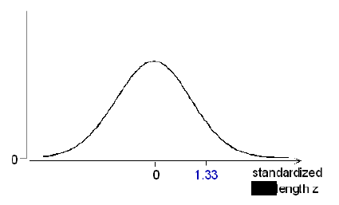
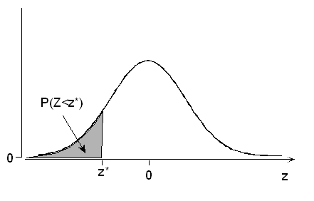
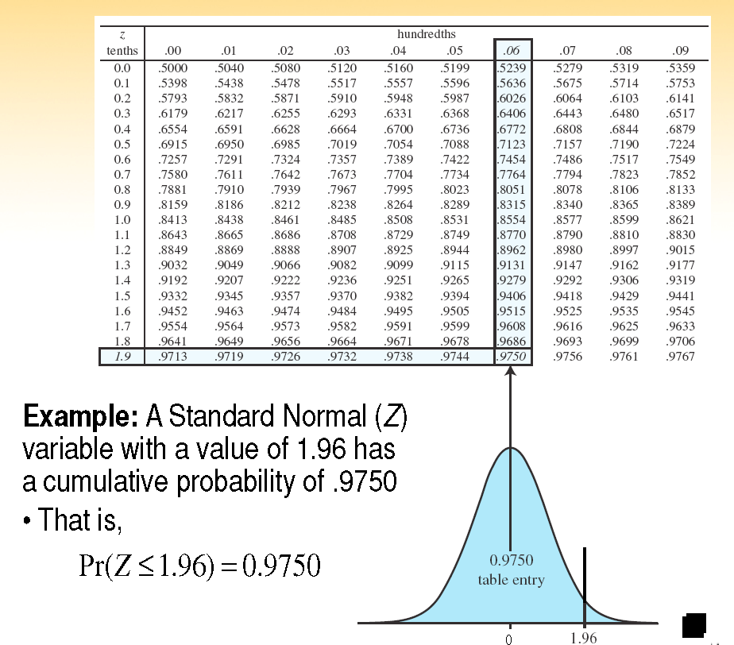
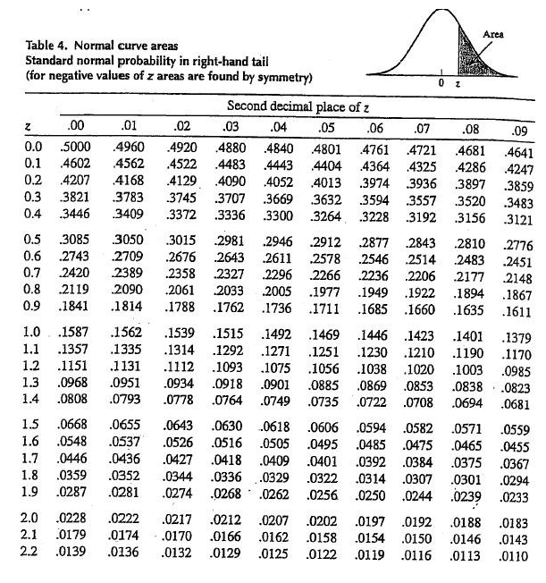

```{r child = "../setup.Rmd"}
```

```{r packages, echo=FALSE, message=FALSE, warning=FALSE}
library(tidyverse)
library(knitr)
```


### Normal Distribution

In this slide deck, we explore the *normal distribution*, one of the primary inferential tools in statistical science! 

The normal distribution is commonly called the *Gaussian distribution* after [Carl Friedrich Gauss](https://en.wikipedia.org/wiki/Carl_Friedrich_Gauss), who wrote down the equations governing it in the early 1800's. It is also sometimes referred to as a *bell curve*.

---

### Feet!

At the risk of having you forever associate the normal distribution with stinky feet, thinking about shoe sizes is a nice formulation for the Gaussian distribution.

Mickle et al (2010 *Footwear Science*) showed the following bimodal distribution of shoe sizes in the US. 

```{r echo=FALSE, out.width="80%"}
knitr::include_graphics("img/bimodalshoes.png")
```

Note that standard shoe sizes are discrete.

---

### Shoe Sizes

These data are from a slightly different sample than the one used by Mickle. Let $X$ represent shoe size for mens' shoes. Here is a (hypothetical) distribution of shoe sizes from a random sample of 10,000 wearers of men's shoes.

```{r echo=FALSE}
set.seed=121372
x=rnorm(10000,mean=11,sd=1.5)
x2=2*x
xcat=round(x2,digits=0)
xdf = data.frame(cbind(xcat = xcat / 2, x))
ggplot(data = xdf, aes(x = xcat)) + 
  geom_bar(aes(y = (..count..)/sum(..count..)),fill="#003087") + 
  scale_x_continuous(n.breaks=10) +
  labs(x = "Shoe Size",
       y = "Percent",
       title = "US Men's Shoe Sizes")

```


---

### Shoe Sizes


If we want to know the probability that a customer coming into a store wants a man's shoe size smaller than 9, we just add up the heights of the bars for shoe sizes 8.5 and smaller. We can do this for shoe sizes in any range and tabulate the full discrete distribution of shoe sizes.


```{r echo=FALSE}
ggplot(data = xdf, aes(x = xcat)) + 
  geom_bar(aes(y = (..count..)/sum(..count..)),fill="#003087") + 
  scale_x_continuous(n.breaks=10) +
  labs(x = "Shoe Size",
       y = "Percent",
       title = "US Men's Shoe Sizes")
```
]

---

## Smaller Shoes

.pull-left[
```{r janitor,warning=FALSE,message=FALSE,echo=FALSE}
library(janitor)
distx <- xdf %>%
  tabyl(xcat)
distx[1:11,]
```
]
.pull-right[
```{r janitor2,warning=FALSE,message=FALSE,echo=FALSE}
distx[12:22,]
```
]

The probability of a random men's shoe wearer having a shoe size less than 9 in this population is `r sum(distx$percent[distx$xcat<9])`.

What is the probability of shoe size 10-11.5?
---

### Continuous Distributions

Now suppose we could get *really* well-fitting shoes, using quarter sizes (9, 9.25, 9.5, 9.75, ...) or even tenth sizes (9, 9.1, 9.2, ...), or shoes specifically made to fit your feet perfectly.  As the number of sizes increases, the bar width becomes more narrow, and the graph approaches a smooth curve.  We will use these smooth curves to describe the probability distributions of continuous random variables (e.g. a shoe size could be 9.50032), concentrating on the *normal distribution*.  The normal distribution below has mean $\mu=11$ and standard deviation $\sigma=1.5$. (*We'll think of these units as inches for now, but note that except right around 11, there is not a perfect mapping from shoe sizes to length in inches.*)

.pull-left[
```{r normal,echo=FALSE,message=FALSE,warning=FALSE,out.width="70%"}
ggplot(data = data.frame(x = c(4, 18)), aes(x)) +
  stat_function(fun = dnorm, n = 10000, args = list(mean = 11, sd = 1.5)) + ylab("") +
  scale_y_continuous() +
  labs (x = "Continuous Shoe Size",
        y = "Density")

```
]
.pull-right[
The *probability density curve* can be used to get the probability of any range of continuous shoe sizes we would like to investigate.
]
---

```{r, echo=FALSE, warning=FALSE, message=FALSE}
ggplot(data.frame(x = c(4, 18)), aes(x = x)) +
  stat_function(fun = dnorm,
                n = 10000,
                args = list(mean = 11, sd = 1.5)) +
  stat_function(
    fun = dnorm,
    args = list(mean = 11, sd = 1.5),
    xlim = c(4, 9),
    geom = "area",
    fill = "#003087",
    alpha = .3
  ) + labs(x = "Continuous Shoe Size")

```

For example, we can calculate probabilities under the normal distribution, such as the probability a continuous shoe size is less than 9 (the shaded area).

---

### Continuous Probability Distributions

- Density curves, like histograms, can have a wide variety of shapes.  The area under a density curve is always 1.
  - How do you find the area of interest in a plot?
  - Calculus! $$Pr(a \leq X \leq b)=\text{area between a and b below the curve}=\int_a^b f(x)dx$$ where $f(x)$ represents the density curve
  - While you will need to know calculus for courses like STA 240, for STA 198/ GLHLTH 298, we can rely on R to provide the probabilities we need.
- We will see density curves for several important distributions -- normal, $t$, $\chi^2$, and $F$ random variables (coming this fall!)

---

### Normal Distribution

For the normal distribution, $$f(x)=\frac{1}{\sqrt{2\pi\sigma^2}}\exp\left\{-\frac{1}{2}\frac{(x-\mu)^2}{\sigma^2}\right\},$$
where the mean is given by $\mu$, the variance by $\sigma^2$, and the standard deviation by $\sigma$.  The notation $N(\mu,\sigma^2)$ is often used.


Also called the Gaussian distribution or bell curve, this distribution is symmetric.

---

### Normal Distribution

```{r echo=FALSE}

```


Which of these normal distributions has the biggest mean?  standard deviation?

---
### Standard Deviation Rule for the Normal Distribution

A useful rule for normal distributions is that roughly 68% of the area under the curve is within one standard deviation $\sigma$ of the mean, 95% is within $2\sigma$, and 99.7% is within $3\sigma$.

```{r echo=FALSE, out.width="50%"}

```

---
The symmetry of the normal distribution also allows us to calculate the probability of values falling in the tails:

```{r echo=FALSE, out.width="50%"}

```

5% of the data are further than two standard deviations, 2 $\sigma$, from the mean, 2.5% in each tail.

---

.pull-left[
```{r echo=FALSE}

```

]
.pull-right[
For our shoe size distribution, normal with mean 11 and standard deviation 1.5, often denoted $N(\mu=11,\sigma^2=1.5^2)$, what is the probability of sizes between 8 and 14?

What is the probability that a randomly chosen US male will have a (continuous) shoe size greater than 12.5 inches?


What is the probability that a randomly chosen US male will have a (continuous) shoe size greater than 13 inches?
 
]
---

### Z-scores

How many standard deviations above the mean is a size 13?  
- Recall $\mu=11$ and $\sigma=1.5$
- 13 is 2 inches above the mean
- 2 inches is $\frac{2}{1.5}=1.33$ standard deviations
- $\frac{13-11}{1.5}=1.33$ is known as a *z-score*

Z-scores are used in many health settings, including
- Evaluating health effects related to body mass index (BMI)
- Measuring child growth (height-for-age, weight-for-age, weight-for-height, BMI-for-age) and identifying malnourished children
- Testing safety of food, water, and environmental samples
- Reporting bone density scan results

---

The *z-score* is a standardized normal variable that tells us now many standard deviations above (positive z-scores) or below (negative z-scores) the mean our original value (13 inch size) is.  That is, $$z=\frac{x-\mu}{\sigma}=\frac{\text{value - mean}}{\text{standard deviation}}.$$


The z-score for the 12.5 inch size is $\frac{12.5-11}{1.5}=1$. 

---

When we standardize by finding z-scores, we change the normal distribution by moving the location (mean moves to zero) and changing the scale (so the standard deviation is one), but the *relative* position of our size 13 (or 1.33 standard deviation) remains the same relative to the rest of the distribution.
 

.pull-left[
```{r echo=FALSE, out.width="110%"}

```

]

.pull-right[
```{r echo=FALSE, out.width="110%"}

```

]

---

 The distribution of the z-scores is known as the *standard normal distribution*.  Here are a few important reference points for this distribution.

```{r echo=FALSE,out.width="50%"}
knitr::include_graphics("img/stdnorm1.png")
```

---

```{r echo=FALSE}
knitr::include_graphics("img/stdnorm2.png")
```

---
```{r echo=FALSE}

```

---
```{r echo=FALSE}

```

---
```{r echo=FALSE}
knitr::include_graphics("img/stdnorm5.png")
```

---

A *standard normal table* allows you to calculate values based on the standard normal distribution.  It tells you how much area is under the normal curve to the *left* of the specified value (lower tail area). Sometimes the table shows the complement of this probability (upper or right tail area). Because the standard normal distribution is symmetric with mean zero, $Pr(Z \leq 0)=0.5$.


```{r echo=FALSE}

```

With modern computing, we don't need to rely on these tables to get the desired probabilities, but you often find them in the back of statistics textbooks.

---

```{r echo=FALSE}

```
What is the probability of a shoe size bigger than 13 (z-score 1.33)?
---

```{r echo=FALSE, out.width="45%"}

```

What is the probability of a shoe size bigger than 13 (z-score 1.33)?

---

### Using R to calculate normal probabilities

Just like we used the `pbinom` command to calculate $P(Y \leq y \mid \pi, n)$ for binomial data, we can use `pnorm` to calculate $P(Y \leq y \mid \mu=0, \sigma^2=1)$ for standard normal data.  For example, to get the probability of a shoe size bigger than 13 (z=1.33), we just take the complement of the probability of a shoe size less than or equal to 13, which is given by `1-pnorm(1.33)` yielding the value `r 1-pnorm(1.33)`.

We can even just have R calculate the z-score for us using the code `1-pnorm(13,mean=11,sd=1.5)`, which yields the value `r 1-pnorm(13,mean=11,sd=1.5)` (more accurate due to lack of rounding).

---


### Probabilities between two values

```{r echo=FALSE}
knitr::include_graphics("img/stdnorm6.png")
```

To get the probability that a random wearer of men's shoes would wear a size between 10 and 12, we just take `pnorm(12,mean=11,sd=1.5)-pnorm(10,mean=11,sd=1.5)` to get the value `r pnorm(12,mean=11,sd=1.5)-pnorm(10,mean=11,sd=1.5)`.

