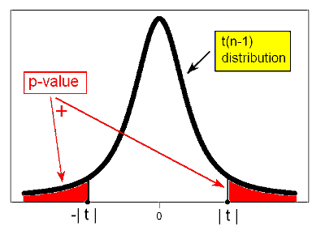
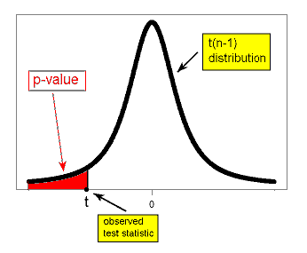
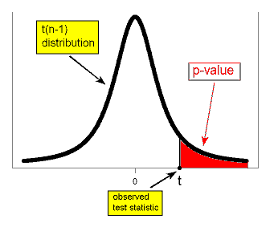
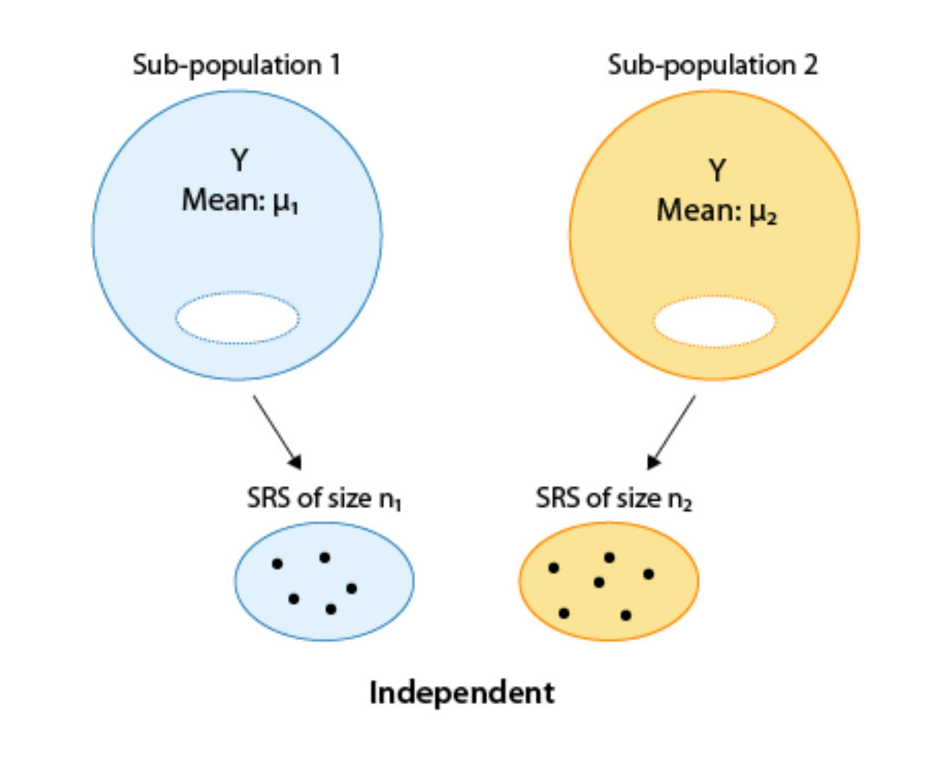
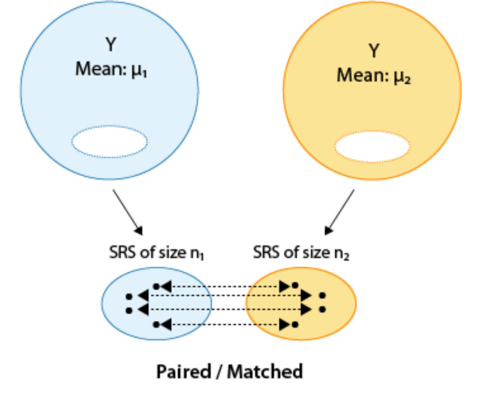

```{r child = "../setup.Rmd"}
```


```{r global_options, include=FALSE}
knitr::opts_chunk$set(echo = TRUE, message = FALSE, warning = FALSE,
                      comment = "#>", highlight = TRUE,
                      fig.align = "center")
library(emo) #for emojis
```

```{r echo=FALSE}
knitr::include_graphics("img/peanutsmath.jpg")
```

---

## Main ideas

-- Learn one-sample test of means

-- Learn one-sample test of proportions

-- Learn two-sample test of means


---
  
### Packages

```{r packages}
library(tidyverse)
library(infer)
library(readxl)
library(BSDA)
```

---


### Hypothesis Testing Framework


Steps in hypothesis testing:

- Start with two claims about the population (often about the value of a population parameter or about some potential association between two variables in the population).  Call them claim 1 and claim 2.

- Choose a sampling strategy, draft an analysis plan, collect data, and summarize data

- Figure out how likely it is to see data like what we got, if claim 1 is true.

- If our data would have been unlikely if claim 1 were true, then we reject claim 1 and deem claim 2 worthy of further study.  Otherwise, we cannot reject claim 1.

---


### Hypothesis Testing About the Mean

1. Hypothesize a value, $\mu_0$, and set up $H_0$ and $H_A$

2. Take a random sample of size $n$ and calculate summary statistics (e.g., sample mean and variance)

3. Is it **likely** that the sample, or one even more extreme, came from a population with mean $\mu_0$?

4. Draw conclusions

---

### Null and Alternative Hypotheses About the Mean

We set up the hypotheses to cover *all* the possibilities for $\mu$ and consider three possibilities.

|  | $H_0$  | $H_A$|
|:------|:------:|:---------:|
| Two-sided | $\mu=\mu_0$ | $\mu \neq \mu_0$ |
| One-sided | $\mu>\mu_0$ | $\mu \leq \mu_0$ |
| One-sided | $\mu<\mu_0$ | $\mu \geq \mu_0$ |

One-sided tests are pretty rare. 

---

### Null and Alternative Hypotheses About a Proportion
We set up the hypotheses to cover *all* the possibilities for $\pi$ and consider three possibilities.

|  | $H_0$  | $H_A$|
|:------|:------:|:---------:|
| Two-sided | $\pi=\pi_0$ | $\pi \neq \pi_0$ |
| One-sided | $\pi>\pi_0$ | $\pi \leq \pi_0$ |
| One-sided | $\pi<\pi_0$ | $\pi \geq \pi_0$ |

One-sided tests are pretty rare. 

---

### Two-Sided Hypothesis Tests

To conduct the hypothesis test, we use what we learned about the sampling distribution of the sample mean $\bar{X}$.  If the underlying population is normally distributed (or $n$ is pretty large), then the random variable $$t=\frac{\bar{X}-\mu_0}{\frac{s}{\sqrt{n}}}$$ has a $t_{n-1}$ distribution, and we can use a *t-test* of our hypothesis by using software (R `t.test`).  This test is called the *one sample t-test*.

For a test of a proportion, where we don't have to estimate a separate variance parameter, we could use a z-statistic and compare to a $N(0,1)$ distribution or even better the exact binomial distribution itself (R `binom.test`).

---

### Behind the Scenes

You will almost always use software to calculate the test statistic and p-value, but it is important to understand the big concepts behind the scenes.

First, think about our test statistic $$t=\frac{\bar{X}-\mu_0}{\frac{s}{\sqrt{n}}}.$$

- $\bar{X}-\mu_0$ makes sense, because we want to look at how far our sample mean is from the hypothesized population mean

- Whether $\bar{X}-\mu_0$ is big depends on the standard deviation.  For example, a difference of $\bar{X}-\mu_0=1$ is a small difference if we are looking at weight in g but huge for height in m.  This is why we standardize the difference by dividing by the *estimated* SD of the mean, so $t$ is a measure of how many SDs apart $\mu_0$ and $\bar{X}$ are from each other

---

### Behind the Scenes

Think about our test statistic $$t=\frac{\bar{X}-\mu_0}{\frac{s}{\sqrt{n}}}.$$

- When our test statistic $t$ is big and our data are approximately normal (or $n$ is large), our data are not consistent with data from a population with mean $\mu_0$
  - Problem: our data might be unlikely under $H_A$ as well (our test will not tell us that!)
  
- When our test statistic $t$  is small (and our data are approximately normal or $n$ is large), then our data do not refute the null hypothesis.

---

### Getting the p-value: 2-sided test

.pull-left-narrow[

|  | $H_0$  | $H_A$|
|:------|:------:|:---------:|
| Two-sided | $\mu=\mu_0$ | $\mu \neq \mu_0$ |
| One-sided | $\mu>\mu_0$ | $\mu \leq \mu_0$ |
| One-sided | $\mu<\mu_0$ | $\mu \geq \mu_0$ |


]
.pull-right-wide[

For a *two-sided* test, the p-value is the probability of seeing a t statistic with absolute value as big as, or larger than, what we saw in our data. Recall $$t=\frac{\bar{X}-\mu_0}{\frac{s}{\sqrt{n}}}.$$

```{r echo=FALSE,out.width="50%"}

```
]

---


### Getting the p-value: 1-sided test

.pull-left-narrow[

|  | $H_0$  | $H_A$|
|:------|:------:|:---------:|
| Two-sided | $\mu=\mu_0$ | $\mu \neq \mu_0$ |
| One-sided | $\mu>\mu_0$ | $\mu \leq \mu_0$ |
| One-sided | $\mu<\mu_0$ | $\mu \geq \mu_0$ |


]
.pull-right-wide[

For a *one-sided* test with $H_0: \mu > \mu_0$, the p-value is the probability of seeing a t statistic with value the same size, or smaller than, what we saw in our data. Recall $$t=\frac{\bar{X}-\mu_0}{\frac{s}{\sqrt{n}}}.$$

```{r echo=FALSE,out.width="50%"}

```
]

---


### Getting the p-value: 1-sided test

.pull-left-narrow[

|  | $H_0$  | $H_A$|
|:------|:------:|:---------:|
| Two-sided | $\mu=\mu_0$ | $\mu \neq \mu_0$ |
| One-sided | $\mu>\mu_0$ | $\mu \leq \mu_0$ |
| One-sided | $\mu<\mu_0$ | $\mu \geq \mu_0$ |


]
.pull-right-wide[

For a *one-sided* test with $H_0: \mu < \mu_0$, the p-value is the probability of seeing a t statistic with value the same size, or larger than, what we saw in our data. Recall $$t=\frac{\bar{X}-\mu_0}{\frac{s}{\sqrt{n}}}.$$


```{r echo=FALSE,out.width="50%"}

```


]
---

### Warning about 1-sided tests

The choice between a one-sided and a two-sided test can be highly controversial because a one-sided test will have a p-value that is half that of the corresponding two-sided test, due to the symmetry of the $t$ distribution.  Sometimes a scientist will (unethically) choose a one-sided test on nonscientific grounds.  To protect against this, some journal editors are extremely reluctant to publish studies using one-sided tests.

---

### Are One-Sided Tests Underutilized?

Usually, you have a pretty good idea what will happen (you do have to get research funding using some justification!).  In this case, why not always do one-sided tests?

---

### CAST (Cardiac Arrhythmia Suppression Trial)

- New generation of antiarrhythmic agents strongly believed to have fewer side effects with much greater efficacy

- Due to strength of this belief, one-sided test was selected

- Recruitment was difficult because many physicians refused to randomize their patients when chance of NOT getting the new drugs was 50%

  - The trial showed new generation drugs associated with 4x the mortality as status quo
  
  - P-value was 0.0003 in the wrong direction (i.e., new drug worse), but with a one-sided test that direction is part of the null hypothesis of *status quo*, so you don't reject the null
  
  - Fortunately the **Data Safety and Monitoring Board** stopped the trial quickly


---


### Lead in Flint, MI

From April 25, 2014 to October 15, 2015, the water supply source for Flint, MI was switched to the Flint River from the Detroit water system. Without corrosion inhibitors, the Flint River water, which is high in chloride, caused lead from aging pipes to leach into the water supply. We have data from Flint collected as part of a citizen-science project involving Virginia Tech researchers.

```{r echo=FALSE}
knitr::include_graphics("img/flintdetroit.jpg")
```

---

### Back to Flint

Let's conduct an $\alpha=0.05$ t-test of $H_0: \mu=15$ versus $H_A: \mu \neq 15$.

```{r getdata}
flint=read_excel("data/Flint-Samples.xlsx",sheet=1)
flint=rename(flint, "Pb_initial"="Pb Bottle 1 (ppb) - First Draw")
t.test(flint$Pb_initial, mu=15)
```

The null value 15 is not in our CI, and the p-value is quite small.  We have evidence to reject the null hypothesis, and fortunately the mean lead level appears to be less than 15.

---

class: middle

# Bootstrapping

---

### Bootstrapping

We can use a bootstrap procedure in hypothesis testing, similar to the one we used to calculate a confidence interval.  

First, let's simulate the null distribution -- what we expect to see if the mean is 15.

```{r simulatenull}
set.seed(1234)
null_dist <- flint %>%
  specify(response = Pb_initial) %>%
  hypothesize(null = "point", mu = 15) %>%
  generate(reps = 10000, type = "bootstrap") %>%
  calculate(stat = "mean")
```

---

### Visualize Null Distribution

```{r visualnull}
visualize(null_dist) +
  labs(x = "Sample means", y = "Count", 
       title = "Simulated null distribution")

```


---

Let's add our sample mean to this distribution and shade the p-value.

```{r sampmean, out.width="40%"}
x_bar <- flint %>%
  summarize(mean_Pb=mean(Pb_initial))

visualize(null_dist) +
  shade_p_value(obs_stat = x_bar, 
                direction = "two-sided") +
  labs(x = "Sample means", y = "Count")
```

 
Notice our sample mean of 10.65 is below the mass of this distribution. 

What is your conclusion?

---

Now suppose instead we wanted to test $H_0: \mu=10$. In this case, we would get a different result:

.panelset[
.panel[.panel-name[Plot]
```{r ref.label = "null10", echo = FALSE, warning = FALSE, out.width = "50%"}
```
Now the p-value, corresponding to the shaded area, is quite large.
]
.panel[.panel-name[Code]

```{r null10, fig.show = "hide"}
null_dist_10 <- flint %>%
  specify(response = Pb_initial) %>%
  hypothesize(null = "point", mu = 10) %>%
  generate(reps = 10000, type = "bootstrap") %>%
  calculate(stat = "mean")

visualize(null_dist_10) +
  shade_p_value(obs_stat = x_bar, 
                direction = "two-sided") +
  labs(x = "Sample means", y = "Count")

```
]
]

---

### Testing proportions

Suppose we wish to test the null hypothesis that 20% of Flint households have water with lead levels over 15 ppb, versus the alternative that this percentage is not 20%.

While we could use the Central Limit Theorem here, we actually have an even better option in R -- we can carry out this test based on the (exact) binomial distribution. With the binomial distribution, we don't have to worry about the sample size or rules of thumb for our test to be accurate. The Central Limit Theorem-based methods became very popular when computers were less powerful, but now we can use *exact* tests much more easily, even when large combinatorial calculations are involved.

This exact binomial test works in the same manner as the test we used earlier for fairness in hiring -- but we can avoid doing it by hand using `binom.test` (you can go back and check that result!).

---


```{r proptestsetup}
flintprop<-flint %>%
  mutate(Pbover15 = Pb_initial > 15) %>%
  summarize(countover15 = sum(Pbover15=="TRUE"),
            n.lead = n(),phat=countover15/n.lead) 
flintprop
```

---
```{r proptest}
binom.test(flintprop$countover15,flintprop$n.lead,p=0.20)
```
---

We can also explore this using simulation.  For binary data, we can draw random samples from a Bernoulli distribution with probability of success equal to the value of `p` given in the code.


.panelset[
.panel[.panel-name[Plot]
```{r ref.label = "simbinom", echo = FALSE, warning = FALSE, out.width = "50%"}
```

]
.panel[.panel-name[Code]

```{r simbinom, fig.show = "hide"}
null_dist_20 <- flint %>%
  mutate(Pbover15 = Pb_initial > 15) %>%
  specify(response = Pbover15, success= "TRUE") %>%
  hypothesize(null = "point", p = 0.2) %>%
  generate(reps = 10000, type = "draw") %>%
  calculate(stat = "prop")

visualize(null_dist_20) +
  shade_p_value(obs_stat = flintprop$phat, 
                direction = "two-sided") +
  labs(x = "Sample proportions", y = "Count")

```
]
]

---

class: middle

# Try it out!

---

### Flint Lead

Public health officials often recommend that residents who have lead in their drinking water run the water for 45 seconds to 2 minutes (called "flushing") to remove as much lead from the drinking water as possible.

In our data, we have two measures taken after flushing the pipes -- one after 45 seconds, and one after two minutes.

The *paired t-test* is useful in situations like this one, where we have an initial measure as well as follow-up measures.  We can simply subtract two measures to obtain a "difference" measure and then carry out a regular one-sample t-test.

---

### Paired t-test

Samples are often paired for a variety of reasons

- Measurements are taken on a single subject at two distinct points in time (e.g., baseline and follow-up)

- Subjects may be matched so that members of each pair are as much alike as possible with respect to important characteristics like age and gender (e.g., matched case-control study)

Pairing can control for unwanted sources of variation that might otherwise influence the results of a comparison.  Matching within subject (e.g., baseline and follow-up) is a powerful way to eliminate subject-specific factors.  

---

What if you use an unpaired test for paired data?

- You will get the same estimates of the means

- If the pairs have positive correlation (almost always the case if you paired correctly), the unpaired estimate of the variance will be larger than the paired estimate.  This means the paired test has greater power.

---

Create two new variables, calculated as (1) initial lead concentration minus the lead concentration after 45 seconds of flushing, and (2) initial lead concentration minus the lead concentration after 2 minutes of flushing.  Then conduct two hypothesis tests: in each case, your goal is to evaluate whether the *paired differences* are 0.   Interpret your results in terms of lead levels before and after flushing. Include useful graphical displays to supplement your test and interpretation.

---


### Two-sample tests of the mean

In practice, we don't usually test that a sample mean equals a single fixed value; instead, we want to compare responses across groups or across different values of covariates.  The type of t-test we use to compare two means depends on how the samples were obtained.  

---

.pull-left[
One approach would be to obtain two independent samples and test the equality of means $\mu_1$ and $\mu_2$.

```{r echo=FALSE}

```
]
.pull-right[
An alternative would be to obtain paired or matched samples and test the equality of means $\mu_1$ and $\mu_2$.  Matching could be by person (e.g., before and after measures) or could be a pair of individuals who belong together in another way (e.g., same date of birth in same hospital, married partners).

```{r echo=FALSE}

```
]
---

### Case Study: Driving While Impaired

Laws regarding the legal limit of blood alcohol while driving vary widely worldwide (some countries do not legislate this, while others have limits as low as 0%). Some studies have shown distraction to affect driving in similar ways as drinking.

Suppose a Department of Motor Vehicles wishes to compare impairment of drivers while texting to impairment after drinking two beers.  Describe an independent samples design and a matched pairs design for this question of interest.

---

### Case Study: Personality or Looks?

A random sample of college students who identified as either male or female answered the question "What is more important to you -- personality or looks?" on a 25 point scale, where 1 indicates personality has maximum importance and looks don't matter, and 25 indicates that looks have maximum importance and personality plays no role.  The researcher was interested in whether gender plays a role in the importance of looks versus personality.

---

The null hypothesis is that males and females place the same emphasis on personality (score is unrelated to gender), while the alternative is that they do not (score is related to gender).  

$$H_0:  \mu_{MALE}=\mu_{FEMALE}$$
$$H_A:  \mu_{MALE}\neq\mu_{FEMALE}$$

OR equivalently,

$$H_0:  \mu_{MALE}-\mu_{FEMALE}=0 $$
$$H_A:  \mu_{MALE}-\mu_{FEMALE}\neq 0$$


---

The researcher enrolled 239 subjects and obtained complete data on 205, with 85 males and 120 females in the complete data sample.  

Analyzing the data, we obtain $\bar{x}_{MALE}=13.33$, $\bar{x}_{FEMALE}=10.73$, $s_{MALE}=4.02$, $s_{FEMALE}=4.25$.

Recall: 1=only personality, 25=only looks

---

### Two-Sample T-Test

The two-sample t-test for independent samples is given by $$t=\frac{(\bar{x}_1-\bar{x}_2)-(\mu_1-\mu_2)}{\sqrt{\frac{{s_1}^2}{n_1}+\frac{{s_2}^2}{n_2}}}.$$ The degrees of freedom (df) depend on whether or not $\sigma_1=\sigma_2$.
---

### Equal or Unequal Variance?

The choice of df depends on whether the independent samples have the same, or different, variances.  There are tests for this in R (e.g., bartlett.test()), but these tests have low power when sample sizes are not large and thus tends to tell you variances are equal in this setting when in fact, they may not be.

If the variances are equal, then we can use a pooled estimate of $s^2$, and the degrees of freedom are given by $(n_1-1)+(n_2-1)=n_1+n_2-2$.  

If the variances are unequal, the degrees of freedom are difficult to derive, and the Welch/Satterthwaite approximation is often used (software will do this for you), which is $df=\frac{\left(\frac{s_1^2}{n_1}+\frac{s_2^2}{n_2}\right)^2}{\frac{1}{n_1-1}\left(\frac{s_1^2}{n_1}\right)^2+\frac{1}{n_2-1}\left(\frac{s_2^2}{n_2}\right)^2}$.  Unequal variances should be the default choice, as the t-test assuming equal variances can be quite unreliable if the variances differ, especially when the group sizes differ as well.

---

```{r twosamplet}
tsum.test(mean.x=13.33, s.x=4.02, n.x=85,
          mean.y=10.73, s.y=4.25, n.y=120,
          var.equal=FALSE)
```

Based on both the test and the 95% confidence interval, we have evidence to reject the null hypothesis that males and females place the same emphasis on looks and personality. In this population, it appears that females place more emphasis on personality than males.

---

### Analysis Limitations and Sensitivity Analysis

- 34 observations (14% of those enrolled) have missing responses
- Because 120 women and 85 men responded, it may be the case that more men than women failed to respond (if all 34 missing observations were from men, would have balanced sample of 120 women and 119 men)
- Perhaps many men failed to respond because they valued personality more than looks (but maybe did not want to admit it)
- In this case it would be possible for these men's responses to overturn the result (in fact having a mean score for men lower than that for women is mathematically possible for this percentage of missing data)
- Be cautious about results of hypothesis testing in the presence of missing data


