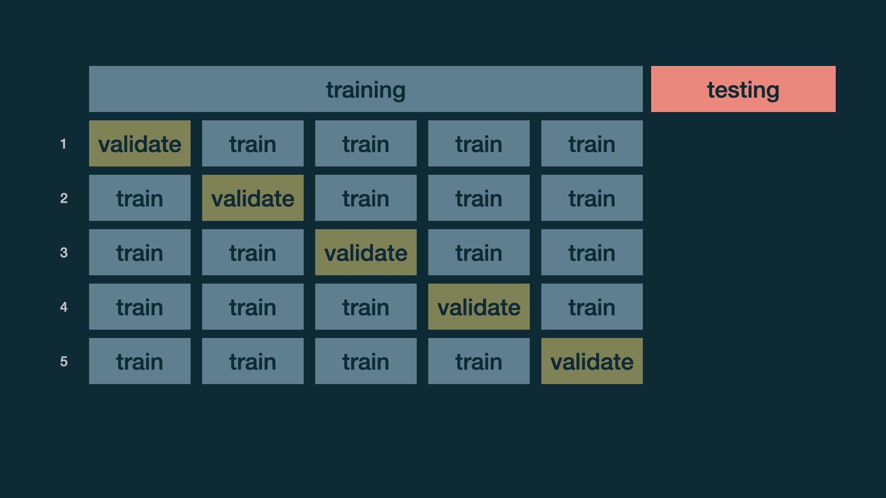

```{r child = "../setup.Rmd"}
```


```{r global_options, include=FALSE}
knitr::opts_chunk$set(
  echo = TRUE,
  message = FALSE,
  warning = FALSE,
  comment = "#>",
  highlight = TRUE,
  fig.align = "center"
)
```

```{r packages, echo = FALSE, message=FALSE, warning=FALSE}
library(tidyverse)
library(tidymodels)
library(gghighlight)
library(knitr)
set.seed(99999)
```

class: middle

# Data and exploration

---

## Mercury data

```{r mercurydata}
mercury <- readr::read_csv("mercury_reg.csv")
mercury <-
  mercury %>%
  # scale() subtracts the mean and divides by the SD to make the units "standard deviations" like a z-score
  mutate(assets_sc=scale(SESassets)) %>%
    #another variable we may use later
  mutate(form_min_sc=scale(FM_buffer)) %>%
  #so I don't have to remember coding
  mutate(sex,sex_cat=ifelse(sex==1,"Male","Female")) %>%
  mutate(native,native_cat=ifelse(native==1,"Native","Non-native")) 

# limit to one observation per household (household ID=1)
mercury1 <-
  mercury %>%
  filter(withinid==1)
mercury1$an_int=mercury1$assets_sc*mercury1$native
```


---

# Modeling

---

## Train / test

- Create an initial split

```{r}
mercury_split <- initial_split(mercury1) # prop = 3/4 by default
```

--
.pull-left[
- Save training data
```{r}
mercury_train <- training(mercury_split)
dim(mercury_train)
```
]

--
.pull-right[
- Save testing data
```{r}
mercury_test  <- testing(mercury_split)
dim(mercury_test)
```
]

---
## Specify model

```{r}
mercury_fit <- linear_reg() %>%
  set_engine("lm") %>%
    fit(lhairHg ~ assets_sc * native_cat + form_min_sc + sex_cat + age + urban, data = mercury_train)
  
mp <- tidy(mercury_fit)
print(mp,n=10)
```

---

class: middle

# Evaluate model

---

## Make predictions for training data

```{r}
mercury_train_pred <- predict(mercury_fit, mercury_train) %>%
  bind_cols(mercury_train %>% select(lhairHg))

mercury_train_pred
```

---

## R-squared

Percentage of variability in the hair mercury explained by the model

```{r}
rsq(mercury_train_pred, truth = lhairHg, estimate = .pred)
```

--

.question[
Are models with high or low $R^2$ preferable?
]

---

## RMSE

An alternative model performance statistic: **root mean square error**

$$ RMSE = \sqrt{\frac{\sum_{i = 1}^n (y_i - \hat{y}_i)^2}{n}} $$

--

```{r rmse-train}
rmse(mercury_train_pred, truth = lhairHg, estimate = .pred)
```

--

.question[
Are models with high or low RMSE are more preferable?
]

---

## Interpreting RMSE

.question[
Is this RMSE considered low or high?
]

```{r ref.label="rmse-train"}
```

```{r}
mercury_train %>%
  summarise(min = min(lhairHg,na.rm=TRUE), max = max(lhairHg,na.rm=TRUE))
```

---
class: middle

.hand[
.light-blue[
but, really, who cares about predictions on .pink[training] data?
]
]

---

## Make predictions for testing data

```{r}
mercury_test_pred <- predict(mercury_fit, mercury_test) %>%
  bind_cols(mercury_test %>% select(lhairHg))

mercury_test_pred
```

---

## Evaluate performance on testing data

- RMSE of model fit to testing data

```{r}
rmse(mercury_test_pred, truth = lhairHg, estimate = .pred)
```

- $R^2$ of model fit to testing data

```{r}
rsq(mercury_test_pred, truth = lhairHg, estimate = .pred)
```

---

## Training vs. testing

<br>

```{r echo=FALSE}
rmse_train <- rmse(mercury_train_pred, truth = lhairHg, estimate = .pred) %>% 
  pull(.estimate) %>%
  round(3)

rsq_train <- rsq(mercury_train_pred, truth = lhairHg, estimate = .pred) %>% 
  pull(.estimate) %>%
  round(3)

rmse_test <- rmse(mercury_test_pred, truth = lhairHg, estimate = .pred) %>% 
  pull(.estimate) %>%
  round(3)

rsq_test <- rsq(mercury_test_pred, truth = lhairHg, estimate = .pred) %>% 
  pull(.estimate) %>%
  round(3)

tibble(
  data      = c(rep("train", 2), rep("test", 2)),
  estimate  = c(rmse_train, rsq_train, rmse_test, rsq_test),
  metric    = c("RMSE", "R-squared", "RMSE", "R-squared")
) %>%
  pivot_wider(names_from = data, values_from = estimate) %>%
  bind_cols(comparison = c("RMSE lower for training", "R-squared higher for training")) %>%
  kable()
```

---

## Evaluating performance on training data

-  The training set does not have the capacity to be a good arbiter of performance.

--

- It is not an independent piece of information; predicting the training set can only reflect what the model already knows.

--

- Suppose you give a class a test, then give them the answers, then provide the same test. The student scores on the second test do not accurately reflect what they know about the subject; these scores would probably be higher than their results on the first test.

.footnote[
.small[
Source: [tidymodels.org](https://www.tidymodels.org/start/resampling/)
]
]

---

class: middle

# Cross validation

---

## Cross validation

More specifically, **k-fold cross validation**:

- Shuffle your data into $k$ partitions
- Use 1 partition for validation, and the remaining $k-1$ partitions for training
- Repeat $k$ times

- Note: our R function calls this **v-fold** cross-validation


---

## Cross validation

```{r echo=FALSE, out.width="100%"}
knitr::include_graphics("img/cross-validation.png")
```

---

## Split data into folds

.pull-left[
```{r}
set.seed(345)

folds <- vfold_cv(mercury_train, v = 5)
folds
```
]
.pull-right[
```{r echo=FALSE, out.width="100%", fig.align="right"}
knitr::include_graphics("img/cross-validation.png")
```
]

---

## Fit resamples

.pull-left[
```{r}
mercury_mod <- linear_reg() %>%
  set_engine("lm")

mercury_rec <- recipe(lhairHg ~ assets_sc + native_cat + form_min_sc + sex_cat + age + urban + an_int, data = mercury_train)

mercury_wflow <- workflow() %>%
  add_model(mercury_mod) %>%
  add_recipe(mercury_rec)

mercury_fit_rs <- mercury_wflow %>%
  fit_resamples(folds)

mercury_fit_rs
```
]
.pull-right[
```{r echo=FALSE, out.width="100%", fig.align="right"}
knitr::include_graphics("img/cross-validation-animated.gif")
```
]

---

## Collect CV metrics

```{r}
collect_metrics(mercury_fit_rs)
```

---

## Deeper look into CV metrics

.panelset[
.panel[.panel-name[Raw]
```{r}
collect_metrics(mercury_fit_rs, summarize = FALSE) %>%
  print(n = 10)
```
]
.panel[.panel-name[Tidy]
```{r echo=FALSE}
collect_metrics(mercury_fit_rs, summarize = FALSE) %>%
  select(id, .metric, .estimate) %>%
  pivot_wider(names_from = .metric, values_from = .estimate) %>%
  kable(col.names = c("Fold", "RMSE", "R-squared"), digits = 3)
```
]
]

---

## How does RMSE compare to y?

- Cross validation RMSE stats

```{r echo=FALSE}
collect_metrics(mercury_fit_rs, summarize = FALSE) %>%
  filter(.metric == "rmse") %>%
  summarise(
    min = min(.estimate),
    max = max(.estimate),
    mean = mean(.estimate),
    med = median(.estimate),
    sd = sd(.estimate),
    IQR = IQR(.estimate)
  )
```
- Training data mercury stats

```{r echo=FALSE}
mercury_train %>%
  summarise(
    min = min(lhairHg,na.rm=TRUE),
    max = max(lhairHg,na.rm=TRUE),
    mean = mean(lhairHg,na.rm=TRUE),
    med = median(lhairHg,na.rm=TRUE),
    sd = sd(lhairHg,na.rm=TRUE),
    IQR = IQR(lhairHg,na.rm=TRUE)
  )
```

---

## Compare to simpler model

Let's check how accurate predictions from this model are: RMSE=1.01, $R^2=0.196$, compared to predictions from a simpler model with age, assets, and native community status.

```{r}

mercury_rec_2 <- recipe(lhairHg ~ assets_sc + native_cat + age, data = mercury_train)

mercury_wflow_2 <- workflow() %>%
  add_model(mercury_mod) %>%
  add_recipe(mercury_rec_2)

mercury_fit_rs_2 <- mercury_wflow_2 %>%
  fit_resamples(folds)

collect_metrics(mercury_fit_rs_2)


```
---

## What's next?

```{r echo=FALSE, out.width="100%", fig.align="right"}

```

---

## Picking a Model

When choosing between these two models, we see essentially the same $R^2$ and RMSE, but one model is much simpler than the other. It makes sense to use the simpler model to facilitate interpretation. Let's practice interpreting results from the model, fit to the full data, now!

```{r finalmodel, out.width="120%", eval=FALSE}
final_fit <- linear_reg() %>%
  set_engine("lm") %>%
    fit(lhairHg ~ assets_sc + native_cat + age, data = mercury1)

final_fit

tidy(final_fit, conf.int=TRUE)
  
```

---


```{r finalmodel2, out.width="120%", echo=FALSE}
final_fit <- linear_reg() %>%
  set_engine("lm") %>%
    fit(lhairHg ~ assets_sc + native_cat + age, data = mercury1)

final_fit

tidy(final_fit, conf.int=TRUE)
  
```