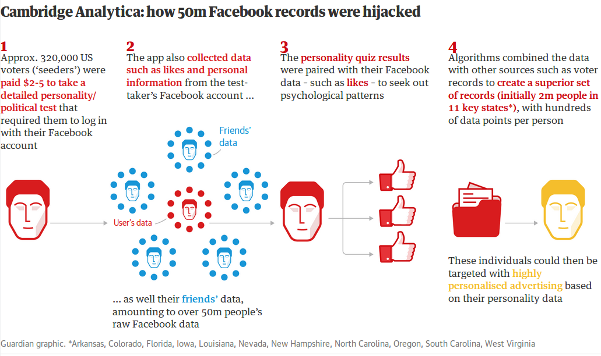

```{r child = "../setup.Rmd"}
```


```{r global_options, include=FALSE}
knitr::opts_chunk$set(
  echo = TRUE,
  message = FALSE,
  warning = FALSE,
  comment = "#>",
  highlight = TRUE,
  fig.align = "center"
)
```

```{r packages, echo = FALSE, message=FALSE, warning=FALSE}
library(tidyverse)
library(tidymodels)
library(gghighlight)
library(knitr)
set.seed(99999)
```

class: middle

# Health Data Science Ethics

---
## Health Data Science Ethics

Data science tools can be used ethically or unethically.

You might be asked to use your knowledge in a way that is
ethically questionable: because of business/policy goals, for the
pursuit of further knowledge, or because your boss tells you to do so. 

How do you train yourself to make the right decisions (or
reduce the likelihood of accidentally making the wrong
decisions) at those points?

---

class: middle

We consider a number of concerns and challenges in conducting ethical health data science work, including privacy, data provenance and sharing, consent, roles of various governmental and non-governmental entities,  algorithmic bias, and accountability. 

---


## Privacy and Consent

- One of the most difficult ethical challenges 
- When is consent required to use data, and how is consent obtained?
- Data that seem innocuous may in fact be quite revealing, especially when data from multiple sources are combined

---

## Privacy

[About My Info](https://aboutmyinfo.org/identity), based on work by Prof. Latanya Sweeney at Harvard, allows you to input very basic data (DOB, binary gender, and ZIP code) and tells you how "unique" you are with respect to others around you. If you'd like, give it a try! 

For example, I'm the only person with my date of birth and gender in my ZIP code, which contains a population of over 45,000 individuals.

---

## Privacy and Consent

It is possible to obtain data from social media and use it to predict quite precisely a number of factors an individual may not yet have decided to "take public," and social media users often have expectations of privacy despite their online activity.

For example, Twitter data are in the public domain. How comfortable would you be with a well-intentioned suicide prevention program screening your tweets and alerting followers if you are considered to be at risk?  Such a program was launched in 2014 but shut down after only a week due to concerns about privacy and stigmatization.

---


## Privacy and Consent

```{r, echo=FALSE}

```

These data were used for "micro-targeting" to influence voting behaviors.
---


## Data Sharing and Control

- Even in public health emergencies like the COVID-19 pandemic, data sharing across international borders is complex, and many political entities have varying degrees of bans on sharing across international borders.

- What is the role of public health surveillance vs data as a business asset?  

- What are reporting requirements for businesses or nonprofit organizations that may detect new outbreaks or health issues as part of their analytics efforts?

---

## Algorithmic Bias

There have been some hideously terrible examples of algorithmic bias in data science 

  - Google and Facebook: both trained image classification algorithms primarily on images of light-skinned humans, misclassifying darker-skinned humans as other primates (nobody caught this?!?)
  
  - Early wearables used optical heart rate sensors that were less accurate when skin contained higher levels of melanin
  
  - Predictive policing and sentencing algorithms have been shown to be fraught with biases
  
  - Well-accepted disease diagnosis cut points and algorithms can bake in disparities (e.g., small-for-gestational-age algorithms that "control" for race/ethnicity; racially-dependent cut points for diabetes)
  
  - Critically important to conduct very careful testing and evaluation of data science products

---

## Target(ed) Advertising

Data science teams at retailers like Target study consumer purchase history and demographics to increase sales. Strategies like appropriately pricing items and sending targeting coupons are employed.

A data scientist at Target used buying data to predict shoppers who may be pregnant or planning pregnancy, based on data from individual shoppers who later signed up for a Target baby registry.

Each shopper received a pregnancy prediction score based on purchases (e.g., pregnancy test, unscented products, vitamin supplements) and was sent coupons timed to specific stages of the pregnancy.

---

## Later...

"My daughter got this in the mail!" complained a parent. "She’s still in high school, and you’re sending her coupons for baby clothes and cribs? Are you trying to encourage her to get pregnant?"

---

## Even later...

"I had a talk with my daughter," the parent said. "It turns out there’s been some activities in my house I haven’t been completely aware of. She’s due in August. I owe you an apology."

  - How do you feel about this?
  - What ethical issues arise when using data for targeted advertising?
  - Is it possible Target’s pregnancy model isn’t very good?


---

## Misrepresentation of Data

```{r, echo=FALSE}
knitr::include_graphics("img/babyboom.png")
```

---

## Misrepresentation of Data

```{r, echo=FALSE}

```

---

## Accountability

Who is accountable for data biases or breaches of ethics?

Everyone!

- producers of biased data (if biases are not acknowledged)
- data analysts
- consumers (should be fairly distrustful and want to see validation of any algorithms)
- leaders of teams

